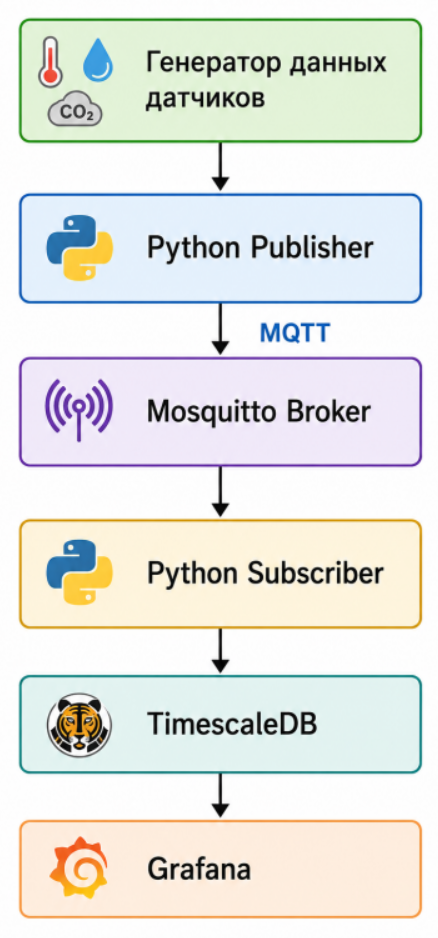
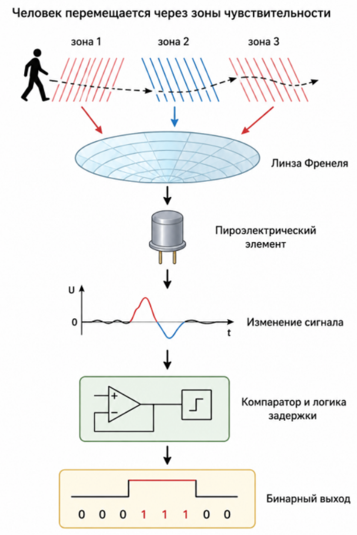
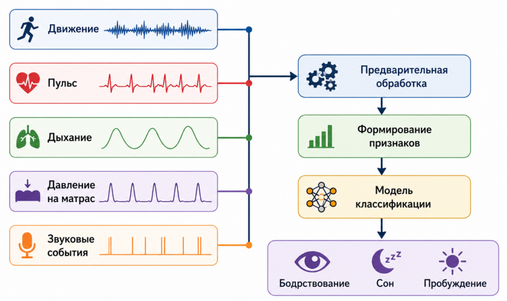
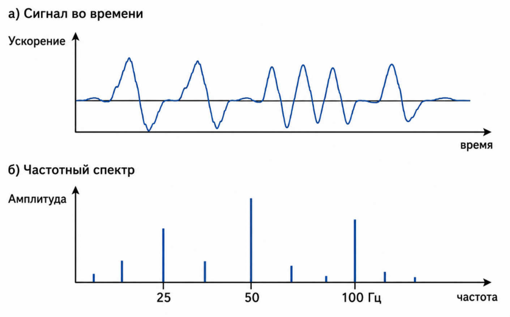
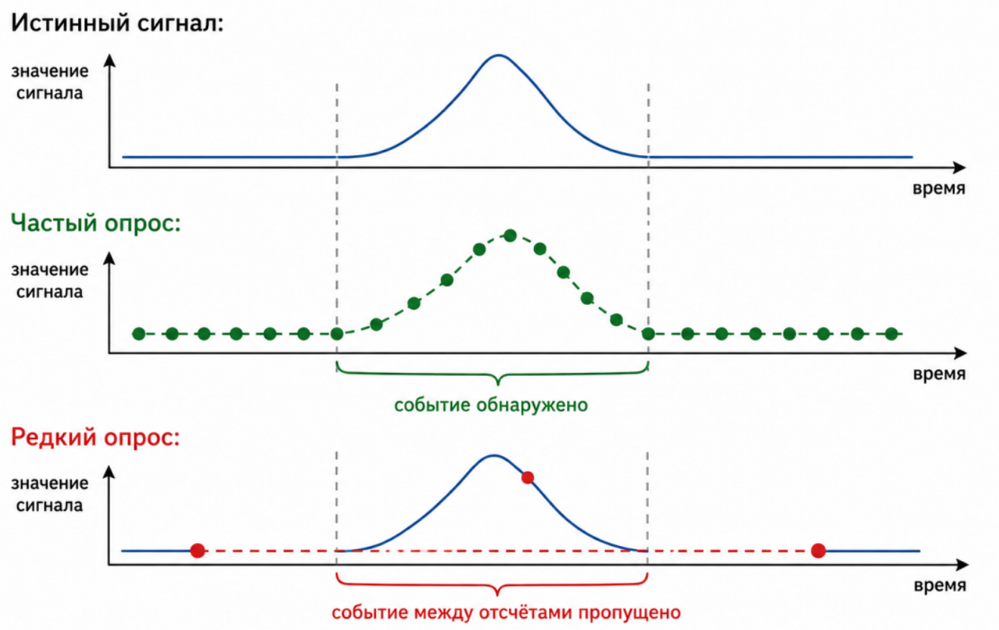

**Занятие 1.1**

**Умный дом как киберфизическая система. Эволюция: от запрограммированной автоматизации к интеллектуальным решениям ИИ. Отличие правил от обучения на данных. Примеры успешных и провальных внедрений.**

Лекционный материал формирует ML-2 (Основы машинного обучения, Способен применять фундаментальные принципы и методы машинного обучения включая подготовку данных оценку качества моделей и работу с признаками). Индикатор компетенции - ML-2.1 (различает основные типы задач МО и применяет на практике принципы их решения). Уровень сформированности индикаторов компетенции базовый - различает основные типы задач машинного обучения (обучение с учителем, без учителя и с подкреплением). Применяет типовые подходы к решению базовых задач с использованием готовых инструментов и библиотек (ScikitLearn).

**Часть 1. Введение**

За последние два десятилетия концепция умного дома прошла путь от набора независимых устройств автоматизации до сложной интеллектуальной системы, способной воспринимать окружающую среду, анализировать происходящие события, прогнозировать поведение пользователей и самостоятельно принимать решения. Если первые системы домашней автоматизации выполняли заранее заданные сценарии, то современные решения все чаще используют методы искусственного интеллекта и машинного обучения, позволяющие адаптироваться к изменяющимся условиям эксплуатации и учитывать индивидуальные предпочтения жильцов.

Развитие вычислительной техники, появление недорогих датчиков, широкополосных сетей передачи данных и специализированных процессоров для выполнения алгоритмов искусственного интеллекта привели к тому, что интеллектуальные функции перестали быть исключительно предметом научных исследований и стали доступны в массовых бытовых устройствах. Сегодня элементы искусственного интеллекта используются в интеллектуальных камерах видеонаблюдения, роботах-пылесосах, системах управления климатом, голосовых помощниках, устройствах контроля доступа и системах мониторинга состояния здоровья.

Согласно ГОСТ Р 71870-2024 устройства умного дома составляют физическую основу построения единой цифровой среды, предназначенной для создания комфортных условий для человека, безопасной эксплуатации и управления зданием. Устройства умного дома должны отвечать принципам бесшовного процесса передачи данных, бесшовной интеграции и интероперабельности, обеспечивая возможность совместного использования оборудования различных производителей для предоставления цифровых сервисов. Возможность использования и (или) управления всеми устройствами умного дома как единым целым посредством единых интерфейсов взаимодействия с пользователем (единое мобильное приложение, голосовой помощник, единый WEB-интерфейс) - основная особенность, отличающая умный дом от самостоятельных разрозненных средств автоматизации отдельных операций и процессов.

Несмотря на широкое распространение термина *«умный дом»*, его трактовка существенно изменилась. Если еще десять--пятнадцать лет назад под умным домом понимали систему, автоматически включающую освещение по расписанию или регулирующую температуру в помещении по заранее установленным правилам, то современный интеллектуальный дом представляет собой сложную **киберфизическую систему**, объединяющую физические объекты, вычислительные устройства, программное обеспечение, каналы связи и человека в единый замкнутый контур управления.

Именно понятие киберфизической системы является ключевым для понимания принципов построения современных интеллектуальных домов. В отличие от традиционных систем автоматизации, киберфизическая система не только реагирует на заранее предусмотренные события, но и непрерывно анализирует состояние окружающей среды, формирует цифровое представление физического мира и принимает решения на основе поступающих данных. Такой подход обеспечивает значительно более высокий уровень автономности, надежности и эффективности управления.

Вместе с тем переход к интеллектуальному управлению поставил перед разработчиками новую проблему. По мере усложнения домашних инженерных систем количество условий, которые необходимо учитывать при принятии решений, стало стремительно возрастать. Простые конструкции вида «если произошло событие А, то выполнить действие Б» перестали обеспечивать требуемое качество управления. Современный умный дом должен одновременно учитывать показания десятков датчиков, изображения с видеокамер, историю поведения жильцов, прогноз погоды, тарифы на электроэнергию, состояние бытовых приборов и множество других факторов. Попытка описать все возможные ситуации с помощью заранее заданных правил приводит к экспоненциальному росту их количества и делает систему практически неуправляемой.

Именно поэтому в последние годы все более широкое распространение получили методы машинного обучения. В отличие от классического программирования, где логика работы системы полностью определяется разработчиком, машинное обучение позволяет автоматически извлекать закономерности из накопленных данных и использовать их для принятия решений. Благодаря этому интеллектуальная система получает возможность адаптироваться к новым условиям эксплуатации без полного перепрограммирования.

Для понимания роли машинного обучения важно различать задачи, которые могут эффективно решаться традиционными алгоритмами, и задачи, требующие применения методов искусственного интеллекта. Например, включение наружного освещения по астрономическому времени удобно реализуется с помощью нескольких логических правил. Однако распознавание владельца дома по изображению лица, обнаружение падения пожилого человека, прогнозирование энергопотребления или определение эмоционального состояния пользователя уже невозможно выполнить без применения методов обработки данных и машинного обучения.

**Часть 2. Умный дом как киберфизическая система**

Современные инженерные системы все чаще объединяют физические объекты с вычислительными средствами, средствами связи и интеллектуальными алгоритмами управления. Подобные системы получили название **киберфизических систем** (Cyber-Physical Systems, CPS). Именно эта концепция лежит в основе промышленной автоматизации, интеллектуального транспорта, робототехнических комплексов, систем цифрового здравоохранения и современных умных домов.

В наиболее общем виде киберфизическую систему можно определить как интегрированную систему, объединяющую физические объекты, средства измерения, вычислительные устройства, программное обеспечение и исполнительные механизмы в единый замкнутый контур управления. Отличительной особенностью таких систем является постоянное взаимодействие цифровой и физической составляющих. Физические процессы непрерывно контролируются с помощью датчиков, полученные данные анализируются вычислительной системой, после чего формируются управляющие воздействия на исполнительные устройства. Изменение состояния физической среды вновь фиксируется датчиками, образуя непрерывный цикл обратной связи.

Идея киберфизических систем возникла как закономерное развитие автоматизированных систем управления. Если классические системы автоматизации были ориентированы главным образом на выполнение заранее заданных алгоритмов, то современные CPS способны учитывать изменяющееся состояние окружающей среды, обмениваться информацией с другими устройствами, взаимодействовать с человеком и использовать методы искусственного интеллекта для принятия решений в условиях неопределенности.

**Рисунок 1 - Архитектура умного дома как киберфизической системы**

Важной особенностью киберфизической системы является тесная взаимосвязь между физическим и цифровым миром. В традиционной информационной системе объектом обработки являются только данные. В киберфизической системе данные непосредственно отражают состояние реальных физических объектов, а результаты вычислений изменяют их поведение. Таким образом, каждое принятое системой решение оказывает влияние на окружающую среду, которая, в свою очередь, формирует новые входные данные для последующих вычислений.

Для наглядности рассмотрим работу интеллектуальной системы управления освещением в квартире. Датчики движения фиксируют присутствие человека, датчики освещенности определяют уровень естественного света, часы реального времени предоставляют информацию о времени суток, а система компьютерного зрения может определить количество людей в помещении и характер их деятельности. На основе совокупности этих данных вычислительный модуль принимает решение о включении, выключении или регулировании яркости осветительных приборов. После изменения освещения датчики вновь измеряют уровень освещенности помещения, что позволяет системе оценить эффективность принятого решения и при необходимости скорректировать параметры управления.

Таким образом, в отличие от простых систем автоматизации, киберфизическая система постоянно функционирует в режиме непрерывного взаимодействия с окружающей средой, обеспечивая адаптивное управление объектом.

## 

## Основные компоненты киберфизической системы

Несмотря на большое разнообразие областей применения, большинство киберфизических систем имеют схожую архитектуру. В ее состав можно выделить несколько функциональных уровней, каждый из которых выполняет определенную роль в процессе получения информации, принятия решений и управления физическими объектами.

## 

## Физическая среда

Физическая среда представляет собой совокупность объектов, состояние которых контролируется системой. Для умного дома это помещения, инженерные коммуникации, бытовые приборы, двери, окна, системы отопления, вентиляции и кондиционирования воздуха, а также сами жильцы.

Именно физическая среда является источником всех событий, происходящих в системе. Изменение температуры воздуха, открытие двери, появление человека в комнате или включение бытового прибора становятся причиной формирования новых данных, поступающих в систему управления.

## 

## Сенсорный уровень

Для наблюдения за состоянием физической среды используются различные типы датчиков. В современных системах умного дома могут применяться десятки различных сенсорных устройств:

- датчики температуры и влажности;

- датчики освещенности;

- датчики движения;

- датчики открытия дверей и окон;

- камеры видеонаблюдения;

- микрофоны;

- датчики утечки воды;

- датчики дыма и газа;

- счетчики электроэнергии;

- датчики качества воздуха.

Каждый из этих датчиков преобразует физические параметры окружающей среды в цифровую информацию, пригодную для последующей обработки вычислительной системой.

Следует отметить, что в последние годы видеокамеры приобретают особое значение. В отличие от специализированных датчиков, измеряющих только один физический параметр, камера содержит огромное количество информации о происходящих событиях. Современные методы компьютерного зрения позволяют по одному видеопотоку одновременно определять присутствие людей, распознавать лица, оценивать позу человека, обнаруживать падения, идентифицировать предметы и анализировать действия пользователей. Поэтому компьютерное зрение становится одним из важнейших источников данных для интеллектуального дома.

## Уровень передачи данных

Информация, полученная от датчиков, должна быть доставлена вычислительным устройствам. Для этого используются проводные и беспроводные каналы связи. В зависимости от назначения системы применяются различные технологии передачи данных: Ethernet, Wi-Fi, Bluetooth Low Energy, ZigBee, Z-Wave, Thread, LoRaWAN и другие.

При выборе способа передачи данных учитываются требования к пропускной способности, задержкам, энергопотреблению, надежности и дальности связи. Например, потоковое видео с камер требует высокой скорости передачи данных, тогда как датчик температуры может передавать несколько байт информации один раз в несколько минут.

## Вычислительный уровень

Вычислительный уровень является «интеллектуальным ядром» киберфизической системы. Именно здесь выполняется обработка поступающих данных, анализ состояния среды, прогнозирование развития событий и формирование управляющих воздействий.

В зависимости от архитектуры системы вычисления могут выполняться на различных устройствах:

- микроконтроллерах;

- одноплатных компьютерах (например, Raspberry Pi);

- локальных серверах;

- облачных вычислительных платформах;

- специализированных ускорителях искусственного интеллекта.

Современные системы все чаще используют комбинированный подход, при котором часть вычислений выполняется непосредственно на периферийных устройствах (Edge AI), а наиболее ресурсоемкие задачи передаются в облачные сервисы.

## Уровень принятия решений

После обработки данных система должна определить наиболее подходящее действие. В простейших случаях решение принимается на основе заранее заданных правил. Однако при большом количестве факторов или наличии неопределенности применяются методы машинного обучения и искусственного интеллекта.

Например, система может оценить вероятность присутствия человека в помещении, спрогнозировать изменение температуры, определить риск возникновения аварийной ситуации или распознать нестандартное поведение жильцов.

Таким образом, уровень принятия решений является связующим звеном между анализом данных и непосредственным управлением физическими объектами.

## Исполнительный уровень

Последним этапом работы киберфизической системы является воздействие на окружающую среду. Для этого используются исполнительные устройства (актуаторы), преобразующие цифровые управляющие сигналы в физические действия.

К исполнительным устройствам умного дома относятся:

- осветительные приборы;

- электроприводы жалюзи и штор;

- термостаты;

- клапаны отопительной системы;

- замки дверей;

- сирены;

- системы вентиляции;

- кондиционеры;

- электрические розетки;

- роботы-пылесосы.

Именно исполнительные устройства позволяют системе изменять состояние физической среды и достигать поставленной цели управления.

## Выводы

Киберфизическая система представляет собой не просто совокупность датчиков и исполнительных устройств, а интегрированную интеллектуальную среду, в которой физические процессы непрерывно взаимодействуют с цифровыми технологиями. Основным отличием таких систем от традиционной автоматизации является наличие замкнутого контура управления, обеспечивающего постоянный обмен информацией между окружающей средой и вычислительной системой. В архитектуре современного умного дома можно выделить шесть основных уровней: физическая среда, сенсорный уровень, уровень передачи данных, вычислительный уровень, уровень принятия решений и исполнительный уровень. Понимание роли каждого из этих компонентов является необходимой основой для дальнейшего изучения методов машинного обучения и искусственного интеллекта, применяемых в интеллектуальных системах управления.

# 

# Эволюция умного дома: от автоматизации к интеллектуальным системам

Идея автоматизации жилого пространства появилась задолго до возникновения понятий «умный дом» и «искусственный интеллект». Первые устройства, предназначенные для повышения комфорта проживания, выполняли исключительно одну функцию и не взаимодействовали между собой. К ним можно отнести автоматические выключатели освещения, программируемые таймеры, механические термостаты и простейшие охранные сигнализации. Каждое устройство функционировало независимо, а его работа определялась конструкцией или несколькими заранее установленными настройками.

С развитием микроэлектроники появились программируемые контроллеры, которые позволили объединять различные устройства в единую систему управления. В конце XX века широкое распространение получили технологии домашней автоматизации, основанные на проводных шинах передачи данных, таких как KNX, X10, а позднее --- BACnet и Modbus. Благодаря этим технологиям появилась возможность создавать сценарии совместной работы различных инженерных систем здания.

Например, при нажатии одной кнопки могли одновременно выполняться несколько действий: выключалось освещение, закрывались жалюзи, переводилась в экономичный режим система отопления и активировалась охранная сигнализация. Такие сценарии значительно повысили уровень комфорта пользователей и стали основой первых коммерческих систем «умного дома».

Однако, несмотря на внешнюю интеллектуальность, подобные системы оставались полностью детерминированными. Все варианты поведения заранее определялись разработчиком или пользователем, а любое изменение условий эксплуатации требовало ручной перенастройки правил.

## 

## Эволюция подходов к управлению

Развитие интеллектуальных домов можно условно разделить на пять поколений, каждое из которых отражает изменение подходов к обработке информации и принятию решений.

## 

## Первое поколение --- локальная автоматизация

Первое поколение характеризовалось использованием автономных устройств, выполняющих строго определенную функцию. Типичным примером является датчик движения, автоматически включающий освещение при появлении человека в помещении. Аналогичным образом работали механические термостаты, поддерживающие температуру воздуха в заданном диапазоне.

Основным преимуществом подобных систем являлась простота реализации и высокая надежность. Однако они не учитывали контекст происходящих событий и не могли адаптироваться к изменяющимся условиям.

## Второе поколение --- программируемые сценарии

Следующим этапом стало объединение различных устройств в единую сеть управления. Пользователь получил возможность самостоятельно создавать сценарии автоматизации.

Например:

- если открылась входная дверь после 18:00 --- включить освещение в прихожей;

- если никого нет дома --- перевести отопление в экономичный режим;

- если обнаружена утечка воды --- перекрыть подачу воды и отправить уведомление владельцу.

Появились первые графические среды настройки автоматизации, не требующие глубоких знаний программирования.

Именно на этом этапе широкое распространение получила концепция **правил вида IF--THEN** («если --- то»), которая до настоящего времени используется во многих коммерческих системах домашней автоматизации.

## 

## Третье поколение --- Интернет вещей (IoT)

Следующим этапом развития стало массовое распространение Интернета вещей (Internet of Things, IoT). Практически каждое устройство получило возможность подключения к локальной сети или сети Интернет.

Появились:

- интеллектуальные розетки;

- Wi-Fi-камеры;

- умные лампы;

- голосовые помощники;

- беспроводные датчики;

- облачные сервисы управления.

Количество устройств в одном доме стало измеряться десятками, а иногда и сотнями. Это привело к резкому увеличению объема данных, поступающих в систему управления.

Одновременно возросла сложность взаимосвязей между устройствами. Система должна была учитывать уже не несколько датчиков, а большое количество разнообразных источников информации, включая данные о погоде, тарифах на электроэнергию, геолокации пользователя и состоянии инженерных коммуникаций.

## Четвертое поколение --- интеллектуальные системы

Накопление больших объемов данных сделало возможным применение методов машинного обучения.

На данном этапе система перестает просто реагировать на заранее определенные события и начинает анализировать закономерности.

Например, интеллектуальный термостат способен самостоятельно определить:

- в какое время жильцы обычно возвращаются домой;

- какую температуру они предпочитают;

- насколько быстро прогревается помещение;

- как влияют погодные условия на теплопотери здания.

На основе этих данных система начинает прогнозировать будущие события и заранее подготавливать помещение к приходу жильцов.

Другим примером является интеллектуальная система видеонаблюдения. Если раньше камера только фиксировала происходящее, то современные алгоритмы способны автоматически распознавать лица, обнаруживать оставленные предметы, выявлять подозрительное поведение, определять падение человека и различать домашних животных, людей и транспортные средства.

Таким образом, происходит переход от реакции на события к их интерпретации.

## 

## Пятое поколение --- самообучающиеся киберфизические системы

Современные исследования направлены на создание полностью адаптивных интеллектуальных систем.

Такие системы способны:

- самостоятельно выявлять закономерности поведения пользователей;

- прогнозировать потребление энергии;

- оптимизировать расписание работы бытовой техники;

- обнаруживать аномалии;

- адаптироваться к изменению состава семьи;

- учитывать предпочтения каждого пользователя;

- использовать генеративный искусственный интеллект для взаимодействия с человеком на естественном языке.

Фактически дом становится интеллектуальным помощником, который не ожидает команд пользователя, а предлагает оптимальные решения на основе анализа большого количества данных.

Возникает закономерный вопрос: почему инженеры не ограничились системами, основанными на правилах? Ответ связан с постоянным ростом сложности как самих домов, так и требований пользователей.

Современное жилое помещение представляет собой сложный инженерный объект. Даже небольшая квартира может содержать десятки датчиков, несколько камер наблюдения, интеллектуальные бытовые приборы, системы безопасности, климатическое оборудование, мультимедийные устройства и средства контроля энергопотребления. Все эти компоненты непрерывно генерируют информацию, которую необходимо учитывать при принятии решений.

Если система должна определить, следует ли включать освещение, недостаточно знать только факт появления человека в комнате. Желательно учитывать уровень естественного освещения, время суток, текущую активность пользователя (чтение, просмотр фильма, сон), количество людей в помещении, наличие детей, предпочтения конкретного жильца и даже уровень заряда аккумуляторов автономных светильников. Каждое новое условие увеличивает число возможных комбинаций состояний системы.

По мере роста количества факторов классический подход, основанный на ручном описании правил, становится все менее эффективным. Разработчику приходится учитывать огромное количество вариантов развития событий, что приводит к усложнению программного обеспечения, увеличению вероятности ошибок и затрудняет дальнейшее сопровождение системы.

Именно в этот момент возникает потребность в методах, способных самостоятельно извлекать закономерности из данных. Машинное обучение позволяет не описывать каждую ситуацию вручную, а формировать математическую модель, которая обучается на примерах и затем применяет полученные знания к новым, ранее не встречавшимся ситуациям. Благодаря этому система становится более гибкой, адаптивной и устойчивой к изменениям условий эксплуатации.

**Рисунок 2 -- Эволюция систем умного дома**

Эволюция умного дома отражает общий путь развития информационных технологий --- от выполнения заранее заданных команд к интеллектуальному анализу данных и принятию решений на основе накопленного опыта. Если первые поколения домашних систем ограничивались автоматизацией отдельных устройств, то современные решения представляют собой сложные киберфизические системы, объединяющие большое количество взаимосвязанных компонентов. Рост объема данных, увеличение числа подключенных устройств и усложнение пользовательских сценариев сделали традиционный подход, основанный на экспертных правилах, недостаточным. Именно это стало основной предпосылкой широкого внедрения методов машинного обучения и искусственного интеллекта в интеллектуальные системы управления.

# Часть 3. От экспертных правил к обучению на данных

## Экспертные системы как основа первых интеллектуальных домов

Первые системы домашней автоматизации создавались по принципу, который и сегодня остается интуитивно понятным большинству разработчиков: поведение системы полностью определяется набором заранее сформулированных правил. Такой подход получил название **экспертной системы**, поскольку логика работы строится на знаниях специалистов предметной области.

В основе экспертной системы лежит правило вида

**ЕСЛИ (условие выполняется), ТО (выполнить действие).**

Например, управление освещением может быть реализовано следующим образом:

- если обнаружено движение в помещении, то включить освещение;

- если движение отсутствует более пяти минут, то выключить освещение;

- если уровень естественного освещения превышает установленный порог, то искусственное освещение не включать.

Аналогичным образом может быть организовано управление отоплением:

- если температура воздуха ниже 20 °С, включить отопление;

- если температура превысила 23 °С, отключить отопление.

Подобные правила легко понять, реализовать и протестировать. Каждое решение системы прозрачно и может быть объяснено пользователю. Именно поэтому экспертные системы до сих пор широко применяются в промышленной автоматизации, системах безопасности и бытовой электронике.

Однако возможности такого подхода ограничены задачами, в которых количество условий невелико, а поведение объекта управления хорошо изучено.

## 

## Преимущества экспертных правил

Несмотря на стремительное развитие искусственного интеллекта, экспертные правила продолжают активно использоваться при проектировании интеллектуальных домов. Это объясняется рядом существенных достоинств данного подхода.

Во-первых, логика работы системы полностью определяется разработчиком. Каждое правило можно проверить, изменить или удалить без влияния на остальные элементы системы. Благодаря этому поведение системы остается полностью предсказуемым.

Во-вторых, выполнение правил практически не требует вычислительных ресурсов. Даже микроконтроллеры с небольшим объемом памяти способны обрабатывать сотни логических условий за доли миллисекунды.

В-третьих, экспертные системы легко сертифицировать при использовании в критически важных приложениях. Если известно, что при срабатывании датчика утечки газа необходимо немедленно перекрыть подачу топлива и включить систему оповещения, применение детерминированного алгоритма оказывается предпочтительнее вероятностной модели машинного обучения.

Наконец, правила обладают высокой объяснимостью. При возникновении ошибки инженер может быстро определить, какое именно условие привело к выполнению того или иного действия. Это существенно облегчает сопровождение программного обеспечения.

Таким образом, экспертные системы остаются эффективным инструментом при решении относительно простых и хорошо формализованных задач.

## 

## Ограничения подхода, основанного на правилах

Проблемы начинают возникать тогда, когда система должна учитывать большое количество факторов одновременно.

Рассмотрим задачу управления освещением в жилой комнате. На первый взгляд она кажется достаточно простой: если человек вошел в помещение, необходимо включить свет. Однако уже после первого анализа становится очевидно, что для принятия правильного решения требуется учитывать значительно больше информации.

Например, необходимо знать:

- сколько человек находится в помещении;

- какой уровень естественного освещения;

- какое сейчас время суток;

- смотрят ли жильцы телевизор;

- работает ли проектор;

- спит ли ребенок;

- открыт ли балкон;

- используется ли ночной режим;

- находятся ли в комнате домашние животные.

Каждый дополнительный фактор увеличивает количество возможных состояний системы. Если предположить, что учитываются всего десять независимых бинарных условий (например, «да» или «нет»), число возможных комбинаций составит

2^10^=1024.

При двадцати условиях число комбинаций возрастет уже до

2^20^=1 048 576.

На практике количество анализируемых параметров значительно больше, причем многие из них принимают не два, а десятки или сотни возможных значений. В результате число потенциальных ситуаций становится настолько велико, что описать каждую из них отдельным правилом практически невозможно.

**Рисунок 3 -- Рост сложности правил**

Именно это явление получило название **комбинаторного взрыва**. Оно является одной из основных причин перехода от экспертных правил к методам машинного обучения.

Рисунок 4 - экспоненциальный рост количества возможных комбинаций условий при увеличении числа анализируемых признаков.

## 

## Когда правила начинают противоречить друг другу

Еще одной серьезной проблемой является возникновение конфликтов между правилами.

Предположим, в системе присутствуют следующие инструкции:

**Правило 1**

Если обнаружено движение --- включить освещение.

**Правило 2**

После 23 часов выключить все источники света.

Возникает ситуация: человек входит в комнату в 23:30.

Какое правило должно иметь больший приоритет?

Добавим еще одно условие.

**Правило 3**

Если ребенок делает домашнее задание --- обеспечить освещенность рабочего места не менее 500 лк.

Теперь возникает новая неоднозначность. Если ребенок занимается после 23 часов, должны одновременно выполняться взаимоисключающие требования: выключить свет и обеспечить нормативное освещение.

Для устранения подобных конфликтов приходится вводить систему приоритетов, исключений и дополнительных условий. Со временем такая структура становится настолько сложной, что изменение одного правила может неожиданно повлиять на работу всей системы.

По мере роста числа сценариев сопровождение экспертной системы начинает занимать больше времени, чем ее первоначальная разработка.

## 

## Мир значительно сложнее набора логических условий

Еще одна фундаментальная проблема заключается в том, что окружающая среда редко бывает полностью определенной.

Предположим, система видеонаблюдения должна ответить на вопрос:

«Находится ли человек в комнате?»

Для программиста естественным выглядит желание сформулировать правило:

если на изображении обнаружены две ноги, две руки и голова, значит, в помещении находится человек.

Однако в реальных условиях подобное правило практически никогда не работает.

Человек может быть частично закрыт мебелью, сидеть в кресле, лежать на диване, наклониться за предметом или находиться в условиях недостаточного освещения. Кроме того, изображение может содержать шумы, блики, тени и другие помехи.

Количество возможных вариантов настолько велико, что заранее предусмотреть их невозможно.

Аналогичная ситуация возникает практически во всех задачах компьютерного зрения, распознавания речи и анализа поведения человека.

Именно поэтому современные интеллектуальные системы вместо жестких правил используют математические модели, способные самостоятельно находить статистические закономерности в данных.

## 

## Переход к обучению на данных

Идея машинного обучения заключается в том, чтобы отказаться от ручного описания всех возможных ситуаций и предоставить системе возможность самостоятельно выявлять зависимости между входными данными и требуемыми результатами.

Рассмотрим пример задачи распознавания человека по изображению.

При использовании экспертной системы разработчик должен самостоятельно определить признаки человека и сформулировать правила их анализа. Такой подход требует значительных трудозатрат и оказывается малоустойчивым к изменению условий съемки.

В случае машинного обучения подход принципиально иной. Разработчик формирует обучающую выборку, содержащую большое количество изображений людей и объектов, не являющихся людьми. Далее алгоритм автоматически определяет, какие признаки наиболее информативны для решения поставленной задачи, и строит математическую модель, позволяющую классифицировать ранее неизвестные изображения.

Таким образом, вместо программирования логики поведения происходит **обучение модели на примерах**.

Именно данные становятся главным источником знаний о предметной области.

## 

## Почему машинное обучение не заменяет правила

Несмотря на впечатляющие возможности современных моделей искусственного интеллекта, было бы ошибкой считать, что экспертные правила полностью утратили свое значение.

На практике наиболее эффективными оказываются **гибридные системы**, сочетающие преимущества обоих подходов.

Так, алгоритм компьютерного зрения может определить, что на полу находится человек с вероятностью 98 %. Однако решение о вызове экстренных служб принимается только после дополнительной проверки ряда условий: отсутствия движения в течение заданного времени, подтверждения события несколькими датчиками и анализа истории предыдущих наблюдений. Такие проверочные механизмы удобно реализовывать с помощью экспертных правил.

Другим примером является интеллектуальный климат-контроль. Модель машинного обучения может прогнозировать оптимальную температуру помещения, а контроллер системы отопления обеспечивает безопасное выполнение этого решения, не допуская превышения допустимых значений температуры или давления теплоносителя.

Следовательно, искусственный интеллект не заменяет традиционные алгоритмы управления, а расширяет их возможности. Наиболее эффективные киберфизические системы используют экспертные правила для обеспечения надежности и безопасности, а методы машинного обучения --- для решения задач, связанных с анализом сложных данных, прогнозированием и адаптацией к изменяющимся условиям эксплуатации.

Экспертные правила стали основой первых интеллектуальных систем благодаря своей простоте, предсказуемости и высокой надежности. Однако по мере усложнения умных домов выявились фундаментальные ограничения такого подхода: комбинаторный рост числа правил, возникновение конфликтов между ними и невозможность описания всех вариантов поведения объектов реального мира. Эти проблемы обусловили переход к обучению на данных, при котором система самостоятельно выявляет закономерности на основе примеров. Вместе с тем современные киберфизические системы не противопоставляют экспертные правила и машинное обучение. Наиболее эффективные решения строятся на их совместном использовании, где логические правила обеспечивают безопасность и объяснимость, а алгоритмы машинного обучения --- адаптивность и способность работать в условиях неопределенности.

## 

## Часть 3 Примеры успешных и провальных внедрений

## 

Рисунок 5 -- Примеры применения ИИ в умном доме.

## 

## Интеллектуальное управление микроклиматом

Одним из наиболее известных примеров успешного применения искусственного интеллекта является интеллектуальное управление отоплением и кондиционированием воздуха.

В традиционных системах пользователь самостоятельно задает расписание работы оборудования или требуемую температуру воздуха. Подобный подход оказывается эффективным только при стабильном распорядке дня. Если режим проживания изменяется, заранее заданные настройки перестают соответствовать реальным потребностям пользователей.

Интеллектуальная система решает эту проблему иначе. Она анализирует историю эксплуатации здания, время возвращения жильцов домой, погодные условия, скорость охлаждения помещений и характеристики отопительного оборудования. На основе этих данных формируется прогноз изменения температуры, позволяющий заранее подготовить помещение к приходу людей.

Такой подход обеспечивает одновременно две цели: повышение комфорта проживания и снижение энергопотребления. Вместо постоянного поддержания высокой температуры система включает отопление только тогда, когда это действительно необходимо.

Следует отметить, что подобные системы не отменяют традиционные алгоритмы управления. Машинное обучение используется для прогнозирования оптимального режима работы, а непосредственное управление отопительным оборудованием выполняется средствами классической автоматизации.

## 

## Интеллектуальные системы видеонаблюдения

Другим примером успешного внедрения машинного обучения являются современные системы видеонаблюдения.

Первые поколения камер выполняли исключительно запись видеоархива. Пользователь был вынужден самостоятельно просматривать записи, чтобы обнаружить интересующие события. Такой подход требовал значительных затрат времени и практически исключал возможность оперативного реагирования.

Современные интеллектуальные камеры способны анализировать видеопоток в режиме реального времени. С помощью алгоритмов компьютерного зрения они могут:

- обнаруживать человека;

- распознавать лица;

- определять направление движения;

- различать людей, животных и транспортные средства;

- выявлять оставленные предметы;

- обнаруживать пересечение запрещенных зон;

- фиксировать падение человека.

Благодаря этому пользователю передается не непрерывный видеопоток, а информация только о действительно значимых событиях.

Например, если камера обнаружила движение дерева во время сильного ветра, тревожное сообщение не формируется. Если же алгоритм определил появление неизвестного человека у входной двери, система немедленно отправляет владельцу соответствующее уведомление.

Таким образом, машинное обучение позволяет существенно сократить количество ложных тревог и повысить эффективность систем безопасности.

## 

## Роботы-пылесосы как пример киберфизической системы

Современные роботы-пылесосы являются одним из наиболее наглядных примеров применения искусственного интеллекта в бытовой технике.

Первые модели перемещались по помещению практически случайным образом. Хотя со временем они очищали большую часть поверхности пола, эффективность такого подхода была невысокой.

Современные устройства используют значительно более сложные методы. Они строят карту помещения, определяют собственное положение, распознают препятствия и планируют маршрут движения.

При этом используются данные различных сенсоров:

- лазерных дальномеров;

- видеокамер;

- ультразвуковых датчиков;

- инерциальных измерительных модулей;

- датчиков столкновения.

Алгоритмы машинного обучения позволяют различать мебель, стены, домашних животных и предметы, случайно оставленные на полу. Благодаря этому уменьшается количество столкновений и повышается качество уборки.

Данный пример хорошо демонстрирует взаимодействие всех компонентов киберфизической системы: сенсоры собирают информацию об окружающей среде, вычислительный модуль анализирует данные и строит карту помещения, после чего исполнительные механизмы изменяют траекторию движения робота.

## 

## Почему некоторые проекты оказываются неудачными?

Несмотря на стремительное развитие искусственного интеллекта, далеко не каждая интеллектуальная система достигает поставленных целей.

Одной из наиболее распространенных причин неудач является недостаточное качество обучающих данных.

Если система распознавания лиц обучалась преимущественно на изображениях, полученных при хорошем освещении, то в ночное время количество ошибок может существенно увеличиться. Аналогично, модель обнаружения падения человека будет работать ненадежно, если обучающая выборка не содержит достаточного количества примеров различных поз, условий освещения и вариантов расположения мебели.

Другой причиной является несоответствие обучающих данных реальным условиям эксплуатации. Например, алгоритм может успешно работать в лаборатории, однако после установки в жилом помещении столкнуться с шумами, отражениями, изменением освещенности и другими факторами, которые отсутствовали во время обучения.

Еще одной серьезной проблемой является переобучение модели. В этом случае алгоритм слишком точно запоминает обучающие данные и теряет способность правильно анализировать новые ситуации. Подобная модель демонстрирует высокую точность на обучающей выборке, но значительно хуже работает в реальной эксплуатации.

## 

## Человеческий фактор

Даже технически совершенная система может оказаться невостребованной, если она неудобна для пользователя.

Представим интеллектуальную систему безопасности, которая ежедневно формирует десятки ложных тревог. Несмотря на высокую чувствительность алгоритмов, постоянные уведомления начинают раздражать владельца. Через некоторое время пользователь либо отключает уведомления, либо полностью перестает обращать на них внимание.

Противоположная ситуация также опасна. Если система пропускает реальные угрозы, доверие к ней быстро утрачивается.

Поэтому при разработке интеллектуальных систем важно учитывать не только математические показатели качества моделей, но и удобство взаимодействия человека с системой. В инженерной практике это свойство часто называют **доверительной надежностью** --- способностью системы поддерживать доверие пользователя за счет стабильной и предсказуемой работы.

## 

## Вопросы безопасности и конфиденциальности

Особое внимание при проектировании интеллектуальных домов уделяется защите персональных данных.

Современные камеры способны анализировать поведение жильцов, определять режим дня, распознавать лица и фиксировать перемещение людей внутри дома. Подобная информация относится к персональным данным и требует надежной защиты.

В последние годы все более широкое распространение получает подход **Edge AI**, при котором обработка изображений выполняется непосредственно на локальном устройстве без передачи видеопотока в облако. На сервер передаются только результаты анализа, например сообщение о том, что обнаружено падение человека или открыта входная дверь.

Такой подход позволяет одновременно уменьшить задержки обработки, снизить нагрузку на сеть и повысить уровень конфиденциальности пользователей.

## 

## Основные факторы успешного внедрения искусственного интеллекта

Опыт разработки интеллектуальных киберфизических систем показывает, что успешное применение машинного обучения определяется не только качеством используемого алгоритма.

Наибольшее влияние оказывают следующие факторы:

- корректная постановка задачи;

- качественная и репрезентативная обучающая выборка;

- грамотный выбор признаков;

- объективная оценка качества модели;

- сочетание методов машинного обучения с традиционными алгоритмами автоматизации;

- удобство использования системы;

- обеспечение информационной безопасности и защиты персональных данных.

Именно комплексное решение перечисленных задач позволяет создавать интеллектуальные системы, способные эффективно функционировать в условиях реальной эксплуатации.

Практика разработки умных домов показывает, что искусственный интеллект является эффективным инструментом повышения уровня автоматизации, однако его применение не гарантирует успех проекта само по себе. Наиболее успешные решения используют машинное обучение для анализа сложных данных, прогнозирования и распознавания событий, сохраняя при этом традиционные методы автоматизации для выполнения критически важных функций управления. Неудачи чаще всего связаны с недостаточным качеством данных, ошибками постановки задачи, переобучением моделей или игнорированием особенностей взаимодействия системы с пользователем. Следовательно, успешное внедрение искусственного интеллекта требует комплексного инженерного подхода, учитывающего технические, эксплуатационные и организационные аспекты.

# 

# Заключение

Развитие современных технологий привело к существенному изменению представлений о системах автоматизации жилых зданий. Если первоначально под умным домом понималась совокупность устройств, выполняющих заранее заданные команды, то сегодня он рассматривается как сложная киберфизическая система, объединяющая физические объекты, сенсоры, вычислительные устройства, средства связи, исполнительные механизмы и человека в единый контур управления. Основной особенностью таких систем является непрерывное взаимодействие цифрового и физического миров: информация о состоянии окружающей среды преобразуется в цифровую форму, анализируется вычислительными средствами, после чего результаты обработки используются для управления инженерными системами здания.

По мере увеличения количества датчиков, исполнительных устройств и пользовательских сценариев стало очевидно, что традиционный подход, основанный исключительно на экспертных правилах, обладает существенными ограничениями. Несмотря на простоту, прозрачность и высокую надежность, системы, построенные на правилах вида «если --- то», плохо масштабируются, требуют постоянного сопровождения и не способны эффективно работать в условиях неопределенности. Рост числа учитываемых факторов приводит к резкому увеличению количества возможных комбинаций событий, что делает разработку и сопровождение подобных систем чрезмерно сложными.

Переход к интеллектуальным методам обработки данных стал закономерным этапом эволюции домашних систем автоматизации. В отличие от традиционного программирования, машинное обучение позволяет формировать математические модели, самостоятельно выявляющие закономерности в накопленных данных и использующие их для принятия решений. Благодаря этому современные интеллектуальные системы способны распознавать объекты на изображениях, прогнозировать изменение параметров окружающей среды, анализировать поведение пользователей, выявлять аномальные ситуации и оптимизировать работу инженерного оборудования без необходимости явного программирования всех возможных вариантов развития событий.

В ходе лекции были рассмотрены три основных направления машинного обучения: обучение с учителем, обучение без учителя и обучение с подкреплением. Несмотря на различие подходов, все они направлены на решение одной общей задачи --- извлечение полезной информации из данных для повышения эффективности принимаемых решений. Выбор конкретного метода определяется характером инженерной задачи, доступностью исходных данных и требованиями к интеллектуальной системе. Именно поэтому разработчик должен не только владеть современными инструментами машинного обучения, но и понимать особенности предметной области, уметь формулировать задачу, выбирать признаки, оценивать качество моделей и критически анализировать полученные результаты.

Отдельное внимание было уделено жизненному циклу разработки модели машинного обучения. Было показано, что успешность проекта определяется не только выбором алгоритма, но и качеством исходных данных, корректностью их подготовки, репрезентативностью обучающей выборки и объективной оценкой результатов. Практический опыт разработки интеллектуальных систем показывает, что именно эти этапы оказывают наибольшее влияние на итоговую эффективность модели. Использование современных библиотек, таких как Scikit-Learn, значительно упрощает реализацию алгоритмов машинного обучения, однако не заменяет инженерного анализа предметной области и не освобождает разработчика от необходимости принимать обоснованные технические решения.

Рассмотренные примеры успешных и неудачных внедрений продемонстрировали, что применение искусственного интеллекта не является самоцелью. Высокая точность алгоритмов сама по себе не гарантирует успешной эксплуатации системы. Надежность, безопасность, удобство использования, защита персональных данных и доверие пользователей оказывают не меньшее влияние на конечный результат, чем математические характеристики модели. Наиболее эффективными являются гибридные решения, сочетающие традиционные алгоритмы автоматизации с методами машинного обучения. В таких системах экспертные правила обеспечивают безопасность и предсказуемость поведения, а модели машинного обучения позволяют анализировать сложные данные, прогнозировать развитие событий и адаптироваться к изменяющимся условиям эксплуатации.

Таким образом, искусственный интеллект не заменяет классические методы автоматизации, а существенно расширяет их возможности. Современный умный дом представляет собой пример сложной киберфизической системы, в которой сенсорные данные, интеллектуальная обработка информации и автоматическое управление образуют единый замкнутый цикл. Понимание принципов построения таких систем является необходимой основой для дальнейшего изучения методов компьютерного зрения, анализа данных и интеллектуального управления, которые будут подробно рассмотрены в последующих лекциях курса.

# 

# 
