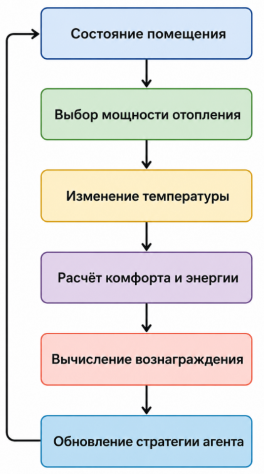
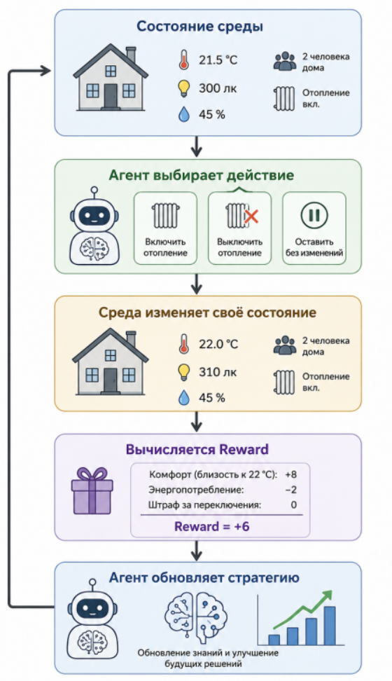
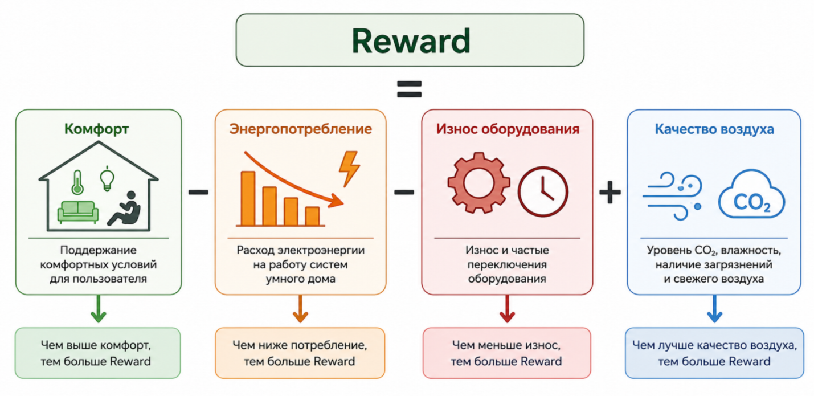
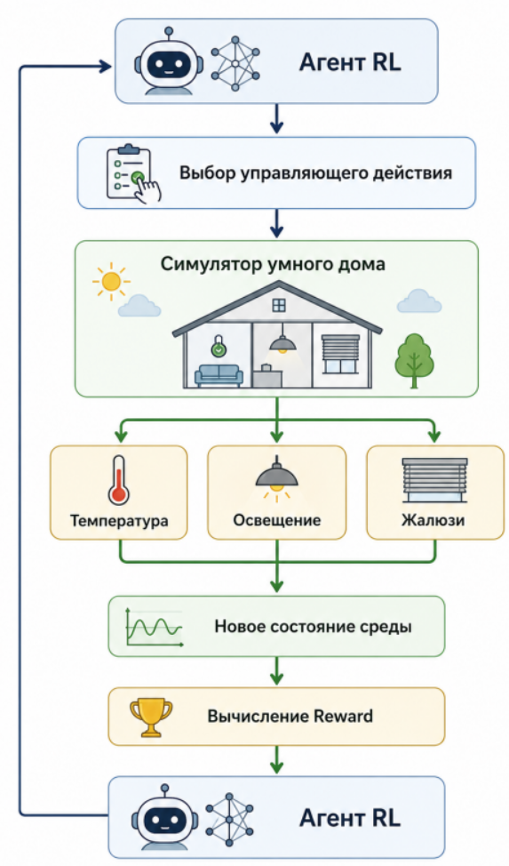
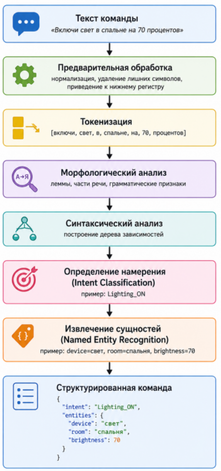
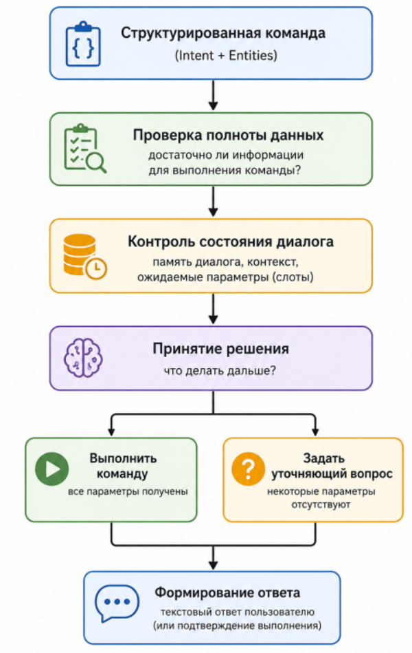
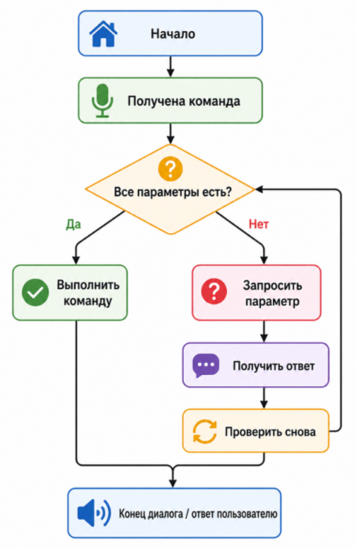
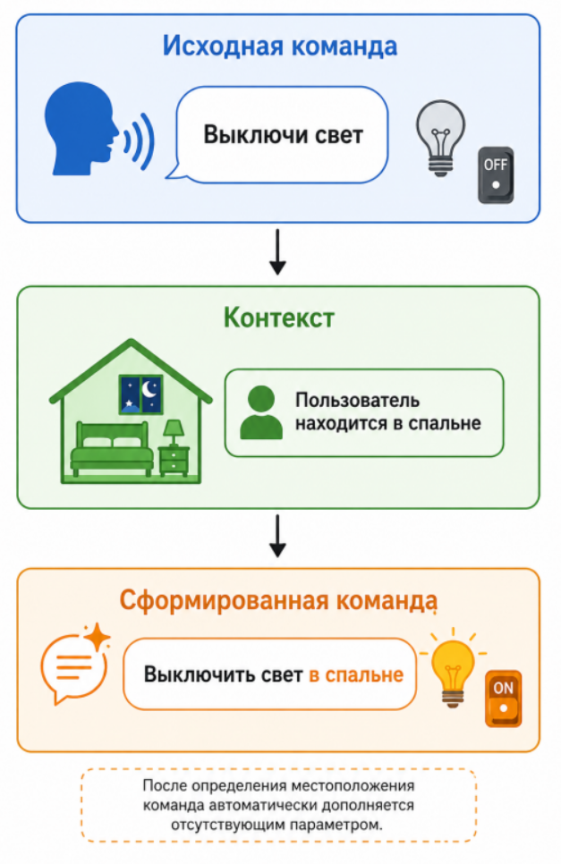

**Занятие 2.5**

**Голосовой интерфейс умного дома**

**Голосовой интерфейс умного дома. Архитектура: Wake Word → ASR → NLU → Dialog Manager → TTS. Проблема понимания контекста и многозадачности в домашней среде.**

**Цель лекции**

Изучить архитектуру современных голосовых интерфейсов интеллектуального дома, рассмотреть методы распознавания речи, обработки естественного языка и управления диалогом, а также познакомиться с современными библиотеками и предобученными моделями, применяемыми при создании интеллектуальных голосовых помощников.

**Формируемая компетенция**

**DL-4. Обработка естественного языка**

**Формулировка компетенции**

Способен применять и (или) разрабатывать алгоритмы, методы и технологии обработки естественного языка.

**Индикатор DL-4.1**

Применяет (проводя выбор и эксперименты) известные алгоритмы и библиотеки для обработки естественного языка, предобученные глубокие нейросетевые модели для прикладных задач анализа текстов, при необходимости дообучая и валидируя на собственных наборах данных.

**Уровень сформированности --- базовый**

Студент:

- владеет регулярными выражениями;

- выполняет токенизацию текста;

- использует морфологический анализ;

- применяет синтаксический анализ;

- знает современные библиотеки обработки естественного языка;

- умеет использовать готовые языковые модели.

**Голосовой интерфейс как интеллектуальная система управления**

За последние годы голосовое управление стало одним из наиболее естественных способов взаимодействия человека с интеллектуальными системами. В отличие от мобильных приложений, настенных панелей или физических выключателей, голосовой интерфейс позволяет отдавать команды без непосредственного контакта с устройством. Особенно важным это становится в условиях умного дома, где пользователь может одновременно выполнять бытовые действия, переносить предметы, готовить пищу или находиться в другой комнате.

Современный голосовой помощник представляет собой не отдельный алгоритм распознавания речи, а сложную интеллектуальную систему, объединяющую несколько специализированных модулей искусственного интеллекта. Каждый из них отвечает за определённый этап обработки информации: обнаружение обращения к устройству, преобразование речи в текст, понимание смысла команды, принятие решения и синтез голосового ответа.

Практически все современные коммерческие системы --- Amazon Alexa, Google Assistant, Apple Siri, Алиса, Home Assistant Voice --- используют похожую многоуровневую архитектуру.

Последовательность обработки голосовой команды можно представить следующим образом:

**Рисунок 1 --- Общая архитектура голосового интерфейса умного дома.**

Следует отметить, что далеко не все перечисленные этапы обязательно выполняются на одном устройстве. В зависимости от архитектуры системы отдельные компоненты могут работать локально (Edge AI), в домашнем сервере или в облачной инфраструктуре. Например, обнаружение ключевого слова обычно выполняется непосредственно на микроконтроллере или одноплатном компьютере, тогда как сложная языковая модель может работать в облаке.

**Архитектура современного голосового помощника**

Работу голосового помощника удобно рассматривать как последовательность преобразований информации. На вход системы поступает акустический сигнал --- изменение давления воздуха, воспринимаемое микрофоном. На выходе система должна выполнить конкретное действие: включить освещение, изменить температуру отопления, запустить сценарий автоматизации или предоставить пользователю голосовой ответ.

При этом форма представления информации неоднократно меняется:

- акустический сигнал;

- цифровой звуковой поток;

- текст;

- структурированное описание намерения пользователя;

- команда системе автоматизации;

- синтезированный речевой ответ.

Таким образом, один и тот же запрос проходит через несколько различных областей искусственного интеллекта:

- цифровую обработку сигналов;

- компьютерную лингвистику;

- обработку естественного языка;

- экспертные системы;

- машинное обучение;

- глубокие нейронные сети.

Например, пользователь произносит:

«Привет, дом. Включи свет в гостиной.»

После прохождения всех этапов обработки система формирует внутреннее представление команды:

> Intent:
>
> Lighting_ON
>
> Room:
>
> LivingRoom
>
> Brightness:
>
> Default

Именно такая структура уже используется системой автоматизации Home Assistant, OpenHAB или другим контроллером умного дома для формирования управляющего воздействия.

Следует обратить внимание, что современные системы практически никогда не используют непосредственное управление устройствами по текстовой строке. Вместо этого естественный язык преобразуется в формализованное представление, состоящее из намерения (Intent) и набора параметров (Entities или Slots). Такой подход обеспечивает независимость языкового интерфейса от конкретной системы автоматизации и позволяет поддерживать несколько языков без изменения логики управления.

**Wake Word Detection --- обнаружение ключевого слова**

Первым этапом работы любого современного голосового помощника является **обнаружение ключевого слова** (*Wake Word Detection*). Данный этап предназначен для определения момента, когда пользователь действительно обращается к интеллектуальной системе.

Если бы устройство непрерывно передавало всю записанную речь на сервер распознавания, это привело бы сразу к нескольким серьёзным проблемам:

- высокой вычислительной нагрузке;

- значительному энергопотреблению;

- постоянному использованию сетевого канала;

- нарушению конфиденциальности пользователя;

- увеличению времени реакции системы.

Поэтому большинство современных интеллектуальных устройств работают по двухступенчатой схеме. Сначала постоянно функционирует небольшой энергоэффективный алгоритм, задача которого заключается исключительно в обнаружении заранее заданной короткой фразы активации. Только после её обнаружения запускается полноценная система распознавания речи.

Наиболее распространёнными примерами ключевых слов являются:

- «Alexa»;

- «Hey Google»;

- «Привет, Алиса»;

- «Hey Siri»;

- «OK Nabu» (Home Assistant Voice).

Таким образом, в обычном режиме устройство не пытается понять содержание разговора людей. Оно лишь оценивает вероятность появления заранее известной последовательности звуков.

**Архитектура обнаружения ключевого слова**

Обнаружение ключевого слова представляет собой отдельную задачу машинного обучения. В большинстве современных устройств используется следующая последовательность обработки сигнала.

**Рисунок 2 --- Архитектура алгоритма Wake Word Detection.**

Каждый блок выполняет строго определённую функцию.

**Получение аудиосигнала**

Голос пользователя воспринимается микрофоном и преобразуется в аналоговый электрический сигнал. Далее встроенный аналого-цифровой преобразователь формирует последовательность цифровых отсчётов.

Как правило,

- частота дискретизации составляет **16 кГц**;

- разрядность --- **16 бит**.

Этого вполне достаточно для качественного распознавания человеческой речи.

Полученный цифровой поток разбивается на небольшие временные окна длительностью 20--30 мс, которые затем анализируются независимо друг от друга.

**Предварительная обработка звукового сигнала**

Непосредственно подавать цифровой звуковой сигнал на нейронную сеть неэффективно. Во-первых, объём данных слишком велик. Во-вторых, соседние отсчёты содержат значительную избыточность.

Поэтому сначала выполняется предварительная обработка сигнала.

Наиболее распространённые операции:

- удаление постоянной составляющей;

- нормализация амплитуды;

- подавление фонового шума;

- оконное преобразование;

- вычисление спектра.

После этого производится переход от временного представления сигнала к частотному.

Для этого используется **быстрое преобразование Фурье (FFT)**.

Результатом становится спектр, показывающий распределение энергии речевого сигнала по различным частотам.

Однако даже спектр содержит значительно больше информации, чем требуется алгоритму обнаружения ключевого слова. Поэтому далее выполняется вычисление специальных признаков.

**MFCC --- мел-частотные кепстральные коэффициенты**

Наиболее популярным способом представления речи являются **Mel Frequency Cepstral Coefficients (MFCC)**.

Идея метода заключается в том, чтобы представить звук не тысячами отсчётов, а несколькими десятками информативных признаков.

Последовательность вычисления MFCC включает несколько этапов:

1.  вычисление спектра;

2.  переход к шкале Mel;

3.  логарифмирование энергии;

4.  дискретное косинусное преобразование.

В результате каждое короткое окно речи описывается, как правило,

**13--40 коэффициентами**.

Получается компактное описание речи, удобное для машинного обучения.

Графически процесс можно представить следующим образом.

**Рисунок 3 --- Получение MFCC-признаков из речевого сигнала.**

Следует отметить, что шкала Mel основана на особенностях восприятия человеком различных частот. Человеческий слух значительно лучше различает низкие частоты, чем высокие. Поэтому при вычислении MFCC низкочастотная область анализируется более подробно.

Именно поэтому MFCC позволяют значительно сократить размерность данных без существенной потери информации.

**Использование нейронных сетей**

Полученные MFCC-признаки поступают на вход небольшой нейронной сети.

В отличие от больших языковых моделей здесь используются максимально компактные архитектуры.

Наиболее распространены:

- CNN;

- DS-CNN (Depthwise Separable CNN);

- TinyCNN;

- MobileNet;

- CRNN.

Почему используются именно такие сети?

Во-первых, обнаружение ключевого слова должно выполняться непрерывно.

Во-вторых, устройство обычно работает от аккумулятора или имеет ограниченные вычислительные ресурсы.

Поэтому модель должна занимать всего несколько сотен килобайт памяти и выполнять обработку за несколько миллисекунд.

Например, современные модели Wake Word Detection имеют:

- размер менее **500 КБ**;

- время обработки менее **20 мс**;

- энергопотребление порядка нескольких милливатт.

Именно поэтому подобные модели могут выполняться непосредственно на микроконтроллерах семейства STM32, ESP32-S3 или специализированных AI-ускорителях.

**TinyML в системах умного дома**

В последние годы широкое распространение получила концепция **TinyML** --- выполнение моделей машинного обучения непосредственно на микроконтроллерах.

Для обнаружения ключевого слова это особенно актуально.

В обычном режиме устройство не использует облачные сервисы и не передаёт звук по сети. Локально работает только небольшая модель Wake Word Detection.

Лишь после обнаружения команды активации начинается следующий этап обработки.

Преимущества такого подхода:

- минимальное энергопотребление;

- высокая скорость реакции;

- отсутствие постоянной передачи аудиоданных;

- сохранение конфиденциальности пользователя;

- возможность автономной работы без подключения к Интернету.

Поэтому современные устройства умного дома всё чаще используют гибридную архитектуру:

- локальное обнаружение ключевого слова;

- локальное подавление шума;

- локальное эхоподавление;

- облачное или локальное распознавание речи;

- локальная автоматизация сценариев.

**Ошибки обнаружения ключевого слова**

Несмотря на высокую точность современных моделей, алгоритмы Wake Word Detection могут допускать два основных типа ошибок.

**Ложное срабатывание (False Accept)**

Система ошибочно считает, что пользователь произнёс ключевое слово.

Например, во время просмотра телевизора устройство случайно активируется, услышав слово, похожее по звучанию на «Alexa».

Последствия:

- запуск ASR без необходимости;

- увеличение энергопотребления;

- возможное нарушение конфиденциальности.

**Пропуск ключевого слова (False Reject)**

Пользователь действительно обращается к устройству, но система не распознаёт ключевую фразу.

Это приводит к отсутствию реакции голосового помощника и ухудшению пользовательского опыта.

Для оценки качества моделей Wake Word Detection используют следующие показатели:

- **False Acceptance Rate (FAR)** --- частота ложных срабатываний;

- **False Rejection Rate (FRR)** --- частота пропуска ключевого слова;

- время обнаружения (Detection Latency);

- энергопотребление модели.

При разработке голосового интерфейса важно подобрать такой порог принятия решения, который обеспечивает компромисс между ложными срабатываниями и пропусками. Слишком низкий порог приведёт к частым ложным активациям, а слишком высокий --- к игнорированию реальных обращений пользователя.

**Automatic Speech Recognition (ASR)**

После успешного обнаружения ключевого слова голосовой помощник переходит к следующему этапу обработки информации --- **Automatic Speech Recognition (ASR)**, или автоматическому распознаванию речи.

Задача ASR заключается в преобразовании акустического сигнала в текстовую последовательность символов или слов. Именно текст становится входными данными для последующих алгоритмов обработки естественного языка (NLU).

Например, пользователь произносит команду:

«Включи свет в гостиной.»

После обработки системой ASR формируется текстовая запись:

Включи свет в гостиной

На первый взгляд задача кажется простой. Однако на практике система сталкивается с большим количеством факторов, осложняющих распознавание речи:

- различные тембры голоса;

- возраст говорящего;

- особенности произношения;

- акцент;

- скорость речи;

- посторонние шумы;

- эхо помещения;

- одновременная речь нескольких людей;

- работа телевизора или бытовой техники.

Поэтому автоматическое распознавание речи является одной из наиболее сложных задач искусственного интеллекта.

**Общая архитектура ASR**

Современные системы распознавания речи используют многоступенчатую архитектуру.

**Рисунок 4 --- Архитектура современной системы автоматического распознавания речи.**

Каждый этап решает собственную задачу.

**Предварительная обработка**

Перед началом распознавания выполняются операции цифровой обработки сигнала:

- удаление фонового шума;

- автоматическая регулировка усиления;

- эхоподавление;

- выделение речевых участков (Voice Activity Detection, VAD);

- нормализация уровня громкости.

Особенно важным является **Voice Activity Detection (VAD)** --- алгоритм определения наличия речи.

Если пользователь молчит, последующие вычисления не выполняются, что значительно снижает вычислительную нагрузку.

**Извлечение акустических признаков**

Следующим этапом вычисляются признаки, характеризующие речь.

Наиболее распространёнными являются:

- MFCC;

- Log-Mel Spectrogram;

- Filter Banks.

В современных нейронных сетях всё чаще используются именно **Log-Mel Spectrogram**, поскольку они лучше подходят для обучения глубоких моделей.

Полученная спектрограмма представляет собой двумерное изображение, где:

- по горизонтали расположено время;

- по вертикали --- частота;

- цвет показывает энергетическую насыщенность сигнала.

Именно поэтому многие современные модели ASR используют архитектуры, аналогичные компьютерному зрению.

**Эволюция технологий распознавания речи**

История развития ASR хорошо демонстрирует эволюцию методов искусственного интеллекта.

**Первое поколение**

В 1970--1990-х годах использовались экспертные системы.

Каждое слово описывалось большим количеством правил.

Недостатки:

- низкая точность;

- плохая масштабируемость;

- невозможность работы со спонтанной речью.

**Второе поколение --- HMM**

Позднее появились **Hidden Markov Models (HMM)**.

Речь рассматривалась как последовательность скрытых состояний.

Каждая фонема соответствовала одному или нескольким состояниям модели.

Вероятность перехода между состояниями вычислялась статистически.

Преимущества:

- возможность работы с непрерывной речью;

- высокая скорость.

Недостатки:

- ограниченная способность описывать сложные зависимости.

**Третье поколение --- HMM + GMM**

Наиболее долго использовалась комбинация

HMM + Gaussian Mixture Model.

Гауссовы смеси описывали распределение акустических признаков.

Такая архитектура использовалась более двадцати лет и лежала в основе первых коммерческих систем распознавания речи.

**Четвёртое поколение --- глубокие нейронные сети**

С развитием GPU произошёл переход к глубокому обучению.

Появились модели:

- DNN;

- CNN;

- RNN;

- LSTM.

Нейронные сети начали непосредственно оценивать вероятность появления фонем.

Точность распознавания значительно выросла.

**Пятое поколение --- Transformer**

Современные системы практически полностью отказались от классических HMM.

Вместо них используются модели Transformer.

Наиболее известные представители:

- Whisper;

- wav2vec 2.0;

- HuBERT;

- SeamlessM4T.

Такие модели способны учитывать длинный контекст речи и обучаются на сотнях тысяч часов аудиозаписей.

**Современные модели ASR**

**Whisper**

Одной из наиболее известных современных моделей является **Whisper**, разработанная компанией OpenAI.

Особенности модели:

- архитектура Transformer Encoder--Decoder;

- обучение более чем на **680 тысячах часов** аудиозаписей;

- поддержка десятков языков;

- высокая устойчивость к шуму;

- возможность автоматического определения языка.

Whisper выполняет сразу несколько задач:

- распознавание речи;

- перевод речи;

- определение языка;

- расстановка знаков препинания.

Для систем умного дома Whisper представляет особый интерес благодаря возможности локального запуска на персональном компьютере или одноплатном компьютере с графическим ускорителем.

**wav2vec 2.0**

Модель **wav2vec 2.0**, разработанная компанией Meta, использует принцип самоконтролируемого обучения (*Self-Supervised Learning*).

Особенность заключается в том, что большая часть модели обучается без текстовой разметки.

Текст используется только на этапе дообучения.

Это позволило значительно сократить объём размеченных данных, необходимых для обучения.

**NVIDIA NeMo**

Платформа **NeMo** представляет собой библиотеку глубокого обучения для построения речевых сервисов.

Она содержит:

- готовые модели ASR;

- модели синтеза речи;

- средства обучения собственных моделей;

- инструменты оптимизации под GPU.

NeMo широко применяется при разработке корпоративных голосовых ассистентов.

**Vosk**

Для локальных систем автоматизации широко используется библиотека **Vosk**.

Преимущества:

- полностью автономная работа;

- отсутствие подключения к Интернету;

- поддержка русского языка;

- возможность запуска на Raspberry Pi.

Именно поэтому Vosk часто используется в проектах Home Assistant.

**Особенности распознавания речи в умном доме**

В отличие от телефонных разговоров или диктовки текста, домашняя среда характеризуется большим количеством помех.

На качество распознавания влияют:

- телевизор;

- музыка;

- работающий пылесос;

- шум кухни;

- открытые окна;

- лай собаки;

- несколько одновременно разговаривающих людей.

Кроме того, пользователь редко произносит команды полностью.

Например,

«Включи.»

или

«Погромче.»

Такие команды невозможно корректно интерпретировать только средствами ASR.

После преобразования речи в текст система ещё не знает:

- что именно включить;

- где увеличить громкость;

- к какому устройству относится команда.

Следовательно, распознавание речи является лишь первым шагом обработки естественного языка.

**Качество распознавания речи**

Для оценки эффективности ASR используются специальные метрики.

**Word Error Rate (WER)**

Наиболее распространённой является **Word Error Rate**.

Она показывает долю слов, распознанных неправильно.

Ошибки подразделяются на три типа:

- удаление слова;

- замена слова;

- вставка лишнего слова.

Например,

Эталон:

Включи свет в спальне

Результат распознавания:

Включи свет спальне

Слово **«в»** отсутствует.

Это считается ошибкой удаления.

**Character Error Rate (CER)**

Для русского языка часто используется **CER** --- ошибка на уровне символов.

Она особенно полезна при распознавании коротких команд.

**Real-Time Factor (RTF)**

Ещё одной важной характеристикой является скорость работы.

Используется показатель **Real-Time Factor**.

Если

RTF = 0,3,

то одна секунда речи распознаётся примерно за **0,3 секунды** вычислений.

Для голосовых интерфейсов желательно, чтобы

RTF \< 1,

то есть распознавание происходило быстрее реального времени.

**Почему ASR недостаточно?**

После завершения работы ASR система получает лишь текстовую строку.

Например:

Выключи свет в спальне.

Для человека смысл этой команды очевиден.

Однако компьютер пока видит только последовательность символов.

Он ещё не знает:

- какое действие требуется выполнить;

- какое устройство имеется в виду;

- какая комната указана;

- нужно ли уточнить дополнительные параметры.

Следовательно, после этапа **Automatic Speech Recognition** начинается следующий, наиболее важный с точки зрения обработки естественного языка этап --- **Natural Language Understanding (NLU)**. Именно здесь выполняются токенизация, морфологический и синтаксический анализ, выделение намерения пользователя (*Intent Classification*) и извлечение сущностей (*Named Entity Recognition*), что позволяет преобразовать текстовую команду в формализованное представление, пригодное для управления устройствами умного дома.

**Natural Language Understanding (NLU) --- понимание естественного языка**

После завершения работы системы автоматического распознавания речи голосовой помощник получает текстовую запись произнесённой пользователем команды. Однако наличие текста ещё не означает понимания его смысла. Для компьютера текст представляет собой лишь последовательность символов Unicode, не содержащую информации о намерениях пользователя, объектах управления или требуемых действиях.

Например, после этапа ASR система получила следующую строку:

«Включи свет в спальне.»

Человек мгновенно понимает, что необходимо включить освещение в определённой комнате. Компьютер же должен последовательно выполнить ряд операций, чтобы прийти к такому же выводу.

Именно этим занимается модуль **Natural Language Understanding (NLU)** --- понимание естественного языка.

Основная задача NLU заключается в преобразовании неструктурированного текста в формализованное описание намерения пользователя, пригодное для дальнейшей обработки системой автоматизации.

Общая схема работы модуля NLU представлена на рисунке 5.

**Рисунок 5 --- Общая схема обработки естественного языка в голосовом интерфейсе умного дома.**

Каждый этап играет важную роль и использует различные алгоритмы и библиотеки.

**Предварительная обработка текста**

Перед выполнением лингвистического анализа текст необходимо привести к единому виду. Этот этап называется **предварительной обработкой** (*Text Preprocessing*).

Даже простые голосовые команды могут содержать особенности разговорной речи:

- слова-паразиты;

- междометия;

- повторы;

- ошибки распознавания;

- различное написание одного и того же слова.

Например, пользователь может произнести:

«Эээ... включи, пожалуйста, свет в спальне.»

После ASR система может получить именно такую строку. Однако для управления освещением слова «эээ» и «пожалуйста» не несут смысловой нагрузки.

Поэтому на этапе предварительной обработки выполняются следующие операции:

- удаление лишних пробелов;

- приведение текста к единому регистру;

- удаление служебных символов;

- нормализация пунктуации;

- фильтрация слов, не влияющих на смысл команды.

После обработки предыдущий пример может быть преобразован в:

«включи свет в спальне»

Следует отметить, что в системах умного дома удаляются далеко не все служебные слова. Например, предлог «в» позволяет определить местоположение устройства и может использоваться при синтаксическом анализе.

**Регулярные выражения**

Одним из первых инструментов обработки текста являются **регулярные выражения** (*Regular Expressions*).

Регулярные выражения представляют собой специальный язык описания текстовых шаблонов. Они позволяют быстро находить в тексте слова, числа, даты, единицы измерения и другие заранее известные конструкции.

Несмотря на широкое распространение глубоких нейронных сетей, регулярные выражения продолжают активно использоваться в современных голосовых интерфейсах благодаря своей простоте, высокой скорости и предсказуемости.

Рассмотрим несколько примеров.

Пользователь произносит команду:

«Установи температуру двадцать три градуса.»

После преобразования числительного в цифровую форму система получает текст:

«установи температуру 23 градуса»

Регулярное выражение позволяет извлечь числовое значение температуры:

\\d+

В результате будет найдено значение:

23

Другой пример:

«Включи свет через 15 минут.»

Регулярное выражение позволяет определить временной интервал:

через\\s+\\d+\\s+минут

Использование регулярных выражений особенно эффективно в тех случаях, когда структура команды заранее известна. Однако они плохо подходят для обработки свободной разговорной речи, содержащей множество вариантов формулировок.

**Токенизация**

Следующим этапом является **токенизация**.

Токенизация представляет собой процесс разделения текста на отдельные смысловые единицы --- **токены**.

Для большинства языков токенами являются отдельные слова.

Рассмотрим команду:

«Включи свет в гостиной.»

После токенизации получится следующая последовательность:

  -------------------
  **№**   **Токен**
  ------- -----------
  1       Включи

  2       свет

  3       в

  4       гостиной
  -------------------

Каждый токен становится отдельным объектом дальнейшей обработки.

Следует отметить, что современные языковые модели используют более сложную токенизацию.

Например, модель **BERT** разбивает текст не на слова, а на **подсловные единицы (Subword Tokens)**.

Такой подход позволяет обрабатывать:

- неизвестные слова;

- опечатки;

- новые термины;

- различные словоформы.

Например:

электроосвещение

может быть разбито на несколько частей:

электро

освещение

Благодаря этому словарь модели значительно уменьшается, а способность обрабатывать ранее не встречавшиеся слова возрастает.

**Морфологический анализ**

Следующим этапом является определение грамматических характеристик слов.

Русский язык обладает богатой системой словоизменения. Одно и то же действие может быть выражено десятками различных словоформ.

Например:

- включить;

- включаю;

- включишь;

- включили;

- включите;

- включай;

- включи.

Для человека очевидно, что все эти слова относятся к одному действию. Однако компьютер должен установить эту связь автоматически.

Эта задача решается с помощью **морфологического анализа**.

Результатом работы анализатора является определение:

- начальной формы слова (леммы);

- части речи;

- рода;

- числа;

- падежа;

- времени;

- лица;

- наклонения.

Например, слово:

«включи»

будет преобразовано к нормальной форме:

включить

В современных российских проектах наиболее часто используются библиотеки:

- **pymorphy2**;

- **Natasha**;

- **Mystem**.

Морфологический анализ особенно важен при построении голосовых помощников на русском языке, поскольку большое количество словоформ значительно усложняет обработку текста.

**Синтаксический анализ**

После определения характеристик отдельных слов необходимо установить связи между ними.

Эта задача называется **синтаксическим анализом** (*Parsing*).

Например, рассмотрим предложение:

«Выключи свет в детской комнате.»

Компьютеру необходимо определить:

- какое слово является главным;

- к какому существительному относится определение «детской»;

- что именно требуется выключить;

- где находится объект управления.

Результатом работы синтаксического анализатора становится **дерево зависимостей**.

Вершиной дерева является глагол:

выключить

От него зависят остальные слова предложения:

выключить

│

┌───┴────────┐

│ │

свет комнате

│

детской

**Рисунок 6 --- Пример дерева синтаксических зависимостей команды голосового помощника.**

Синтаксический анализ позволяет правильно интерпретировать сложные команды, содержащие несколько объектов или обстоятельств.

Например:

«Включи свет в спальне и открой шторы в гостиной.»

Здесь система должна понять, что:

- действие «включить» относится к освещению спальни;

- действие «открыть» относится к шторам гостиной.

Без синтаксического анализа такое разделение было бы значительно сложнее.

Для построения деревьев зависимостей широко используются библиотеки **spaCy**, **Natasha** и модели семейства **UDPipe**, обученные на корпусах Universal Dependencies.

**Определение намерения пользователя (Intent Classification)**

После выполнения предварительной обработки текста, токенизации, морфологического и синтаксического анализа система располагает структурированной информацией о предложении. Однако она ещё не знает, **какое действие требуется выполнить**.

Главной задачей следующего этапа является определение **намерения пользователя** (*Intent*).

Под **Intent** понимают основную цель высказывания, которую необходимо преобразовать в действие системы автоматизации.

Например, рассмотрим несколько голосовых команд.

  ----------------------------------------------------
  **Голосовая команда**          **Intent**
  ------------------------------ ---------------------
  Включи свет                    Lighting_ON

  Выключи свет                   Lighting_OFF

  Сделай ярче                    Lighting_Brightness

  Закрой шторы                   Curtains_Close

  Включи музыку                  Music_Play

  Какая температура в спальне?   Temperature_Query

  Кто стоит у двери?             Camera_Query
  ----------------------------------------------------

Можно заметить, что различные фразы могут иметь одинаковое намерение.

Например,

«Зажги свет.»

«Включи освещение.»

«Сделай светло.»

Все эти команды относятся к одному и тому же действию:

Lighting_ON

Именно поэтому задача классификации намерения значительно сложнее простого поиска ключевых слов.

**Классические методы определения Intent**

Первые голосовые помощники использовали набор заранее написанных правил.

Например:

если встретилось слово

включи

и встретилось слово

свет

↓

Lighting_ON

Подобные системы работали достаточно быстро, однако обладали существенными недостатками.

Пользователь мог сказать:

«Не мог бы ты сделать немного светлее?»

Хотя смысл команды полностью совпадает с предыдущими примерами, простые правила уже не способны правильно определить намерение.

Кроме того, количество возможных вариантов формулировок постоянно растёт.

Поэтому современные голосовые помощники практически полностью отказались от экспертных правил.

**Машинное обучение для классификации намерений**

Следующим этапом развития стали методы машинного обучения.

Каждая команда представлялась в виде числового вектора признаков.

Затем строился классификатор:

- Naive Bayes;

- Logistic Regression;

- Support Vector Machine;

- Random Forest.

Для формирования признаков использовались методы:

- Bag of Words;

- TF-IDF;

- Word2Vec.

Несмотря на значительно более высокую точность по сравнению с экспертными правилами, данные методы плохо учитывали контекст предложения.

Например,

«Не включай свет.»

и

«Включай свет.»

имеют практически одинаковый набор слов.

Следовательно, классические методы могли ошибочно относить обе команды к одному Intent.

**Transformer и языковые модели**

Настоящий прорыв произошёл после появления архитектуры **Transformer**.

В отличие от предыдущих методов, Transformer анализирует предложение целиком и способен учитывать взаимосвязи между всеми словами.

Например,

«Не выключай свет.»

и

«Выключай свет.»

отличаются всего одной частицей **«не»**, однако смысл этих предложений противоположен.

Для Transformer подобное различие является очевидным благодаря механизму **Self-Attention**, который позволяет учитывать влияние каждого слова на остальные элементы предложения.

Поэтому современные системы определения Intent чаще всего используют предобученные языковые модели семейства BERT.

**Предобученные языковые модели**

Обучение большой языковой модели требует огромного объёма данных и вычислительных ресурсов.

Например, современные модели обучаются на миллиардах предложений.

Поэтому на практике практически никогда не создают модель «с нуля».

Используется следующий подход:

1.  берётся уже обученная языковая модель;

2.  заменяется последний классификационный слой;

3.  выполняется дообучение на собственном наборе команд умного дома.

Именно такой процесс называется **Fine Tuning**.

Он полностью соответствует индикатору компетенции DL-4.1.

**BERT**

Модель **BERT (Bidirectional Encoder Representations from Transformers)** была предложена компанией Google в 2018 году и стала одной из самых значимых разработок в области обработки естественного языка.

Главная особенность модели заключается в двустороннем анализе текста.

Если предыдущие модели читали предложение только слева направо, то BERT одновременно учитывает слова как слева, так и справа от рассматриваемого слова.

Например,

«Открой окно в детской.»

Слово

«детской»

правильно интерпретируется только благодаря анализу соседних слов.

**RuBERT**

Для русского языка широко используется модель **RuBERT**, обученная компанией Sber AI.

Она учитывает особенности русского языка:

- богатую морфологию;

- свободный порядок слов;

- большое количество словоформ.

Поэтому именно RuBERT сегодня является одной из наиболее популярных моделей при разработке русскоязычных голосовых помощников.

**Sentence-BERT**

В некоторых задачах необходимо определить не класс команды, а степень похожести двух предложений.

Например,

«Включи свет.»

и

«Сделай освещение ярче.»

имеют схожий смысл.

Для решения подобных задач используется **Sentence-BERT**, преобразующая предложение в компактный числовой вектор фиксированной длины.

Близкие по смыслу предложения располагаются в этом пространстве рядом друг с другом.

Такой подход активно используется при поиске похожих команд и реализации интеллектуального поиска.

**Извлечение сущностей (Named Entity Recognition)**

После определения намерения система должна понять, **какие параметры содержит команда**.

Эта задача называется **Named Entity Recognition (NER)**.

Если Intent отвечает на вопрос

Что нужно сделать?

то NER отвечает на вопрос

С чем необходимо выполнить действие?

Рассмотрим пример.

Пользователь произносит:

«Включи свет в спальне.»

После работы системы получаем:

  -------------------------
  **Поле**   **Значение**
  ---------- --------------
  Intent     Lighting_ON

  Device     Свет

  Room       Спальня
  -------------------------

Теперь рассмотрим более сложную команду.

«Установи температуру двадцать два градуса в детской.»

После обработки формируется структура:

  ----------------------------
  **Поле**      **Значение**
  ------------- --------------
  Intent        Climate_Set

  Temperature   22

  Room          Детская
  ----------------------------

Именно такая структура затем передаётся в систему автоматизации.

**Слоты (Slots)**

В системах управления диалогом параметры команды часто называют **слотами** (*Slots*).

Например,

Intent

Lighting_ON

Слоты:

Room = Спальня

Brightness = 70%

Color = Тёплый

Не все слоты обязательно присутствуют в каждой команде.

Например,

«Включи свет.»

В этом случае система знает только намерение.

Параметры отсутствуют.

Именно поэтому позже модуль управления диалогом задаст уточняющий вопрос.

**Современные библиотеки обработки естественного языка**

При разработке голосовых интерфейсов редко реализуют все алгоритмы самостоятельно. Обычно используются готовые библиотеки, содержащие эффективные реализации наиболее распространённых методов обработки текста.

Наиболее популярные библиотеки представлены в таблице 5.1.

  ----------------------------------------------------------------------------------------------------------------
  **Библиотека**                    **Основное назначение**
  --------------------------------- ------------------------------------------------------------------------------
  **NLTK**                          Базовые алгоритмы NLP, токенизация, лемматизация, работа с корпусами текстов

  **spaCy**                         Высокопроизводительная обработка текста, синтаксический анализ, NER

  **pymorphy2**                     Морфологический анализ русского языка

  **Natasha**                       Комплексная обработка русскоязычных текстов

  **Transformers (Hugging Face)**   Предобученные модели BERT, RoBERTa, GPT, T5, DistilBERT и др.

  **Rasa NLU**                      Определение Intent и извлечение сущностей для диалоговых систем
  ----------------------------------------------------------------------------------------------------------------

В современных проектах эти библиотеки часто используются совместно. Например, токенизация и морфологический анализ могут выполняться с помощью **spaCy** и **pymorphy2**, а определение намерений и извлечение сущностей --- с использованием моделей **RuBERT**, доступных через библиотеку **Transformers**.

**Формирование структурированной команды**

После завершения всех этапов NLU текстовая команда преобразуется в структурированное представление, которое уже не зависит от естественного языка и может быть обработано системой управления умным домом.

Рассмотрим полный пример.

Исходная команда пользователя:

«Включи свет в спальне на 50 процентов.»

После выполнения всех этапов обработки формируется следующая структура:

> {
>
> \"intent\": \"Lighting_ON\",
>
> \"entities\": {
>
> \"room\": \"Спальня\",
>
> \"brightness\": 50
>
> }
>
> }

Эта структура легко интерпретируется системой автоматизации независимо от того, была ли команда произнесена на русском, английском или другом языке. Таким образом, модуль NLU выполняет роль своеобразного «переводчика» между естественным языком человека и формализованным языком управления устройствами.

**Dialog Manager --- управление диалогом**

После того как система определила намерение пользователя (*Intent*) и извлекла необходимые сущности (*Entities*), кажется, что голосовой помощник уже может выполнить требуемое действие. Однако в реальных условиях этого часто оказывается недостаточно.

Рассмотрим простую ситуацию.

Пользователь произносит:

«Включи свет.»

Для человека эта команда может быть совершенно понятной. Если пользователь находится в спальне, он, вероятнее всего, имеет в виду именно освещение этой комнаты. Однако компьютер не обладает подобным здравым смыслом. Если в доме установлено несколько осветительных приборов, возникает неоднозначность: какое именно устройство необходимо включить?

Следовательно, система должна определить, достаточно ли имеющейся информации для выполнения команды. Если данных недостаточно, необходимо организовать диалог с пользователем и получить недостающие сведения.

Именно эту задачу решает **Dialog Manager** --- модуль управления диалогом.

Его основная функция заключается не только в выборе ответа пользователю, но и в хранении состояния разговора, анализе контекста, контроле последовательности вопросов и обеспечении логичного взаимодействия человека с интеллектуальной системой.

Общая схема работы Dialog Manager представлена на рисунке 7.

**Рисунок 7 --- Общая схема работы модуля управления диалогом.**

**Состояние диалога (Dialog State)**

Одним из важнейших понятий является **состояние диалога** (*Dialog State*).

Под состоянием понимается совокупность всей информации, накопленной системой в процессе общения с пользователем.

Например, рассмотрим следующий диалог.

**Пользователь:**

Включи свет.

Система отвечает:

В какой комнате?

Пользователь отвечает:

В спальне.

Компьютер понимает, что второй ответ сам по себе не является законченной командой. Фраза «В спальне» приобретает смысл только в связи с предыдущим вопросом.

Следовательно, Dialog Manager должен сохранить информацию о том, что система ожидает указание помещения для команды включения освещения.

После второго сообщения состояние диалога можно представить следующим образом.

  -----------------------------
  **Параметр**   **Значение**
  -------------- --------------
  Intent         Lighting_ON

  Room           Спальня

  Device         Свет
  -----------------------------

Теперь все необходимые параметры заполнены, и команда может быть передана системе автоматизации.

**Slot Filling --- заполнение слотов**

Ранее было показано, что после работы модуля NLU команда представляется в виде набора параметров --- **слотов** (*Slots*).

Однако далеко не всегда пользователь сообщает все параметры одновременно.

Например:

Установи температуру.

После анализа текста система получает:

> Intent = Climate_Set
>
> Temperature = ?
>
> Room = ?

Очевидно, выполнить такую команду невозможно.

Dialog Manager последовательно собирает отсутствующие данные.

Диалог может выглядеть следующим образом.

**Пользователь**

Установи температуру.

**Система**

Для какой комнаты?

**Пользователь**

Для детской.

**Система**

До какой температуры?

**Пользователь**

Двадцать три градуса.

После завершения диалога структура принимает окончательный вид.

  ----------------------------
  **Поле**      **Значение**
  ------------- --------------
  Intent        Climate_Set

  Room          Детская

  Temperature   23 °C
  ----------------------------

Такой процесс называется **Slot Filling** --- заполнение недостающих параметров команды.

**Диалог как конечный автомат**

На протяжении многих лет управление диалогом строилось на основе **конечных автоматов (Finite State Machine, FSM)**.

В этом случае каждый этап общения соответствует определённому состоянию системы.

Например:

**Рисунок 8 --- Конечный автомат управления диалогом.**

Главными достоинствами такого подхода являются:

- высокая скорость работы;

- предсказуемость поведения;

- простота реализации;

- возможность формальной проверки логики.

Однако существуют и серьёзные недостатки.

По мере роста количества устройств и сценариев число состояний автомата быстро увеличивается. Если в системе поддерживаются десятки типов устройств, сотни сценариев автоматизации и различные способы формулировки команд, конечный автомат становится чрезвычайно сложным и трудно сопровождаемым.

**Контекст диалога**

Одной из наиболее сложных задач голосового интерфейса является понимание **контекста**.

Контекст представляет собой информацию, полученную системой ранее и необходимую для правильной интерпретации текущей команды.

Рассмотрим следующий диалог.

**Пользователь**

Включи телевизор.

**Система**

Телевизор включён.

Через несколько секунд пользователь произносит:

Сделай громче.

Система должна понять, что речь идёт именно о телевизоре, а не о музыкальной системе, домашнем кинотеатре или интеллектуальной колонке.

В этом случае контекст может быть представлен следующим образом.

  ---------------------------------------------------
  **Последнее устройство**   **Телевизор**
  -------------------------- ------------------------
  Последнее действие         Включение

  Активный диалог            Управление телевизором
  ---------------------------------------------------

Теперь команда

Сделай громче.

будет автоматически преобразована в

> Device = TV
>
> Action = Volume_Up

без необходимости повторно называть устройство.

**Долговременный контекст**

Современные интеллектуальные системы используют не только текущий диалог, но и долговременную информацию о пользователе.

Например, если пользователь регулярно произносит команду:

Доброе утро.

система может автоматически выполнять заранее определённый сценарий:

- открыть шторы;

- включить освещение кухни;

- запустить кофеварку;

- сообщить прогноз погоды;

- прочитать события календаря.

В данном случае смысл команды определяется не её буквальным содержанием, а накопленным опытом взаимодействия с пользователем.

Таким образом, система использует долгосрочный контекст, включающий:

- предпочтения пользователя;

- историю предыдущих действий;

- расписание;

- текущие сценарии автоматизации;

- конфигурацию умного дома.

**Управление несколькими устройствами**

Домашняя среда существенно отличается от большинства других областей применения голосовых помощников.

В одном помещении одновременно могут находиться десятки интеллектуальных устройств:

- освещение;

- кондиционер;

- телевизор;

- акустическая система;

- робот-пылесос;

- жалюзи;

- камеры наблюдения.

Пользователь может произнести сложную составную команду.

Выключи свет в спальне и включи кондиционер в детской.

После работы NLU получается несколько независимых намерений.

  ---------------------------------------
  **Intent**     **Device**    **Room**
  -------------- ------------- ----------
  Lighting_OFF   Свет          Спальня

  Climate_ON     Кондиционер   Детская
  ---------------------------------------

Dialog Manager должен определить, что это две отдельные операции, сформировать две управляющие команды и обеспечить их корректное выполнение.

**Современные подходы к управлению диалогом**

В настоящее время используются три основных подхода.

**Правила (Rule-Based)**

Все сценарии заранее определяются разработчиком.

Преимущества:

- высокая надёжность;

- предсказуемость;

- простота тестирования.

Недостатки:

- низкая гибкость;

- сложность поддержки больших проектов.

**Машинное обучение**

Следующее поколение систем использует модели машинного обучения для выбора наиболее вероятного ответа.

В качестве признаков используются:

- текущее состояние диалога;

- история общения;

- результаты работы NLU;

- профиль пользователя.

Подобные системы способны учитывать значительно больше факторов, чем конечные автоматы, однако требуют наличия размеченных диалоговых корпусов для обучения.

**Большие языковые модели (LLM)**

Современным направлением развития являются большие языковые модели (Large Language Models), такие как GPT, Llama, Gemma и другие.

В этом случае Dialog Manager перестаёт быть набором заранее заданных правил и превращается в интеллектуального агента, способного самостоятельно планировать последовательность действий, задавать уточняющие вопросы и выбирать наиболее подходящий ответ.

Например, пользователь может сказать:

«Мне холодно.»

Вместо буквального ответа LLM способна проанализировать текущую температуру в помещении, историю предпочтений пользователя и предложить несколько вариантов решения:

- увеличить температуру отопления;

- включить тёплый пол;

- закрыть открытое окно;

- запустить заранее настроенный сценарий «Комфорт».

Такой подход делает взаимодействие с системой более естественным, но требует тщательного контроля, поскольку генеративные модели могут предлагать некорректные действия. В системах умного дома решения LLM обычно ограничиваются политиками безопасности и комбинируются с классическими правилами автоматизации.

**Проблема понимания контекста и многозадачности в домашней среде**

На первый взгляд голосовое управление кажется достаточно простой задачей. Пользователь произносит команду, система преобразует речь в текст, определяет намерение и выполняет соответствующее действие. Однако в реальных условиях домашней эксплуатации подобная схема оказывается недостаточной.

В отличие от специализированных систем управления отдельными устройствами, интеллектуальный дом представляет собой динамическую среду, в которой одновременно присутствуют несколько пользователей, десятки интеллектуальных устройств, большое количество автоматических сценариев и непрерывно изменяющаяся окружающая обстановка.

В результате одна и та же голосовая команда может иметь совершенно различный смысл в зависимости от контекста её произнесения.

Например, рассмотрим команду:

«Выключи свет.»

Если в квартире имеется только одна комната, задача не вызывает затруднений. Однако современный умный дом обычно включает множество помещений и осветительных приборов. Следовательно, системе необходимо определить, какой именно источник света следует отключить.

Для принятия правильного решения голосовой помощник анализирует не только текст команды, но и дополнительную информацию:

- текущее местоположение пользователя;

- историю предыдущего диалога;

- активные устройства;

- сценарии автоматизации;

- состав пользователей в доме;

- текущее время суток.

Таким образом, понимание контекста становится одной из центральных задач интеллектуального управления.

**Пространственный контекст**

Одним из наиболее важных видов контекста является **пространственный контекст**.

Он определяет взаимное расположение пользователя и устройств умного дома.

Рассмотрим ситуацию.

В квартире имеются:

- спальня;

- гостиная;

- кухня.

Во всех помещениях установлены интеллектуальные светильники.

Пользователь находится в спальне и произносит:

«Выключи свет.»

С высокой вероятностью он имеет в виду освещение именно спальни.

Однако если в этот момент пользователь управляет системой через мобильное приложение, находясь вне дома, данная логика уже неприменима.

Следовательно, системе необходимо определить текущее местоположение пользователя.

Для этого могут использоваться различные источники информации:

- Wi-Fi;

- Bluetooth-маяки;

- камеры;

- датчики присутствия;

- смартфон пользователя;

- ультраширокополосные системы позиционирования (UWB).

После определения местоположения команда автоматически дополняется отсутствующим параметром.

Например:

**Рисунок 9 --- Использование пространственного контекста для уточнения голосовой команды.**

**Временной контекст**

Время также оказывает существенное влияние на интерпретацию команд.

Рассмотрим несколько примеров.

Утром пользователь говорит:

«Открой шторы.»

Это действие вполне логично.

Однако аналогичная команда поздно вечером может быть неожиданной и даже нежелательной.

Другой пример:

«Включи свет.»

Днём система может выбрать минимальную яркость или вообще предложить не включать освещение при достаточном естественном свете.

Ночью же предпочтительным становится мягкое освещение небольшой интенсивности, чтобы не ослепить пользователя.

Следовательно, при принятии решения используются дополнительные параметры:

- текущее время;

- день недели;

- восход и заход солнца;

- календарные события;

- режим дома (день, ночь, отпуск, отсутствие жильцов).

**Контекст пользователя**

Современный умный дом редко обслуживает только одного человека.

Как правило, в квартире проживает несколько пользователей:

- родители;

- дети;

- пожилые родственники;

- гости.

Каждый из них имеет собственные предпочтения.

Например:

  -----------------------------------------------------
  **Пользователь**   **Предпочтительная температура**
  ------------------ ----------------------------------
  Иван               22 °C

  Мария              24 °C

  Ребёнок            25 °C
  -----------------------------------------------------

Рассмотрим команду:

«Сделай потеплее.»

Если её произнёс Иван, система может увеличить температуру до 23 °C.

Если ту же команду произнесла Мария, оптимальным решением станет повышение температуры до 25 °C.

Следовательно, голосовой помощник должен сначала определить личность говорящего.

Для этого применяются технологии **Speaker Recognition** и **Speaker Verification**, анализирующие индивидуальные особенности голоса человека.

Идентификация пользователя позволяет персонализировать работу интеллектуального дома и повысить комфорт взаимодействия.

**Контекст устройств**

Важную роль играет текущее состояние устройств.

Предположим, пользователь говорит:

«Сделай громче.»

Если в доме одновременно работают:

- телевизор;

- музыкальная колонка;

- домашний кинотеатр,

то система должна определить, к какому устройству относится команда.

При отсутствии дополнительного контекста выполнить такую команду невозможно.

Поэтому Dialog Manager анализирует:

- какое устройство использовалось последним;

- какое устройство сейчас воспроизводит звук;

- на каком устройстве недавно изменялась громкость;

- какое устройство находится ближе к пользователю.

На основании этих данных определяется наиболее вероятный объект управления.

**Контекст предыдущего диалога**

Большинство голосовых команд невозможно правильно интерпретировать без учёта истории разговора.

Рассмотрим следующий пример.

**Пользователь**

Включи кондиционер.

**Система**

Какая температура?

**Пользователь**

Двадцать три.

Ответ пользователя не содержит ни устройства, ни действия.

Тем не менее система понимает, что число «двадцать три» относится именно к температуре кондиционера.

Следовательно, Dialog Manager хранит информацию обо всех незавершённых вопросах и использует её при интерпретации последующих сообщений.

Подобный механизм называется **контекстным диалогом** (*Context-Aware Dialogue*).

**Конфликты команд**

Особую проблему представляют конфликтующие команды.

Предположим, один пользователь говорит:

«Открой окно.»

Через несколько секунд другой пользователь произносит:

«Включи кондиционер.»

Одновременное выполнение этих действий приведёт к значительным потерям энергии.

Следовательно, интеллектуальная система должна обнаружить конфликт между сценариями.

Возможные варианты решения:

- запросить подтверждение пользователя;

- временно приостановить выполнение одной из команд;

- выбрать наиболее приоритетное действие;

- применить заранее определённые правила автоматизации.

Таким образом, Dialog Manager постепенно превращается в интеллектуальную систему поддержки принятия решений.

**Проактивное поведение голосового помощника**

Современные интеллектуальные системы способны не только выполнять команды, но и самостоятельно инициировать взаимодействие с пользователем.

Такое поведение называется **проактивным** (*Proactive AI*).

Например, система может обнаружить следующую ситуацию:

- пользователь покинул дом;

- входная дверь закрыта;

- свет остался включён.

Вместо немедленного отключения освещения помощник может обратиться к пользователю:

«Вы ушли из дома, но свет в гостиной остался включён. Выключить его?»

Другой пример:

«Температура в детской комнате повысилась до 28 °C. Включить кондиционер?»

В подобных случаях система самостоятельно анализирует показания датчиков, историю поведения пользователей и текущий контекст, а затем предлагает наиболее вероятное действие. Такой подход повышает комфорт эксплуатации, однако требует особого внимания к вопросам безопасности, конфиденциальности и предотвращения навязчивого поведения интеллектуального помощника.

**Ограничения современных систем**

Несмотря на значительный прогресс в области искусственного интеллекта, современные голосовые помощники всё ещё сталкиваются с рядом ограничений:

- трудности понимания сложных причинно-следственных связей;

- ошибки при длинных многошаговых диалогах;

- неоднозначная интерпретация местоимений («его», «это», «там»);

- недостаточное понимание жизненного контекста пользователя;

- сложности при одновременной речи нескольких человек;

- ограниченная способность объяснять причины принятых решений.

Именно поэтому современные исследования активно развиваются в направлении интеграции больших языковых моделей, знаний о предметной области (Knowledge Graphs), механизмов долговременной памяти и методов рассуждений (Reasoning).

**Современные программные платформы и библиотеки**

При разработке голосовых интерфейсов для интеллектуальных систем практически никогда не реализуют все алгоритмы самостоятельно. Вместо этого используются готовые библиотеки, программные платформы и предобученные модели, которые существенно сокращают время разработки и позволяют сосредоточиться на создании прикладной логики управления.

Наиболее распространённые инструменты представлены в таблице 9.1.

  ----------------------------------------------------------------------------------------------------------------
  **Компонент архитектуры**   **Примеры библиотек и моделей**                 **Основное назначение**
  --------------------------- ----------------------------------------------- ------------------------------------
  Wake Word Detection         Porcupine, OpenWakeWord, Precise                Обнаружение ключевого слова

  ASR                         Whisper, Vosk, wav2vec 2.0, NVIDIA NeMo         Преобразование речи в текст

  NLP                         spaCy, NLTK, pymorphy2, Natasha                 Токенизация, морфология, синтаксис

  Языковые модели             BERT, RuBERT, Sentence-BERT, Transformers       Классификация намерений, NER

  Dialog Manager              Rasa, Home Assistant Conversation, Dialogflow   Управление состоянием диалога

  TTS                         Piper, Coqui TTS, VITS, XTTS, FastSpeech 2      Синтез естественной речи
  ----------------------------------------------------------------------------------------------------------------

Современные голосовые интерфейсы строятся по модульному принципу, что позволяет заменять отдельные компоненты без изменения архитектуры всей системы. Например, вместо облачной модели распознавания речи можно использовать локальную модель Whisper или Vosk, а модуль синтеза речи заменить на Piper или Coqui TTS, сохранив при этом неизменными остальные компоненты конвейера.

**Заключение**

Голосовой интерфейс является одним из наиболее естественных способов взаимодействия человека с интеллектуальными системами умного дома. Его работа основана на последовательном выполнении нескольких взаимосвязанных этапов: обнаружении ключевого слова (Wake Word Detection), автоматическом распознавании речи (ASR), понимании естественного языка (NLU), управлении диалогом (Dialog Manager) и синтезе речи (TTS).

Особое значение в современных системах приобретают методы обработки естественного языка. Они позволяют преобразовать произвольную речевую команду в формализованное представление, пригодное для автоматического управления устройствами. Для этого используются как классические методы обработки текста --- регулярные выражения, токенизация, морфологический и синтаксический анализ, --- так и современные предобученные модели семейства Transformer, включая BERT и RuBERT.

Развитие больших языковых моделей открывает новые возможности для создания интеллектуальных голосовых помощников, способных поддерживать длительный контекстный диалог, учитывать индивидуальные особенности пользователей и принимать решения в условиях многозадачности. Именно поэтому технологии обработки естественного языка сегодня являются одним из наиболее активно развивающихся направлений искусственного интеллекта и играют ключевую роль в построении интеллектуальных систем управления умным домом.
