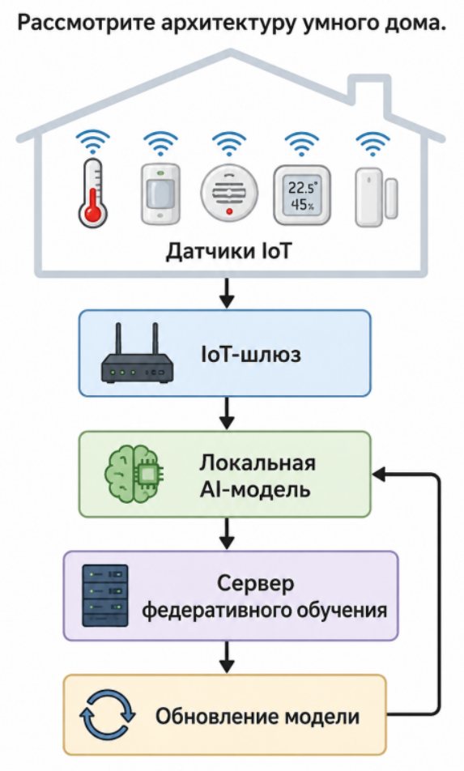
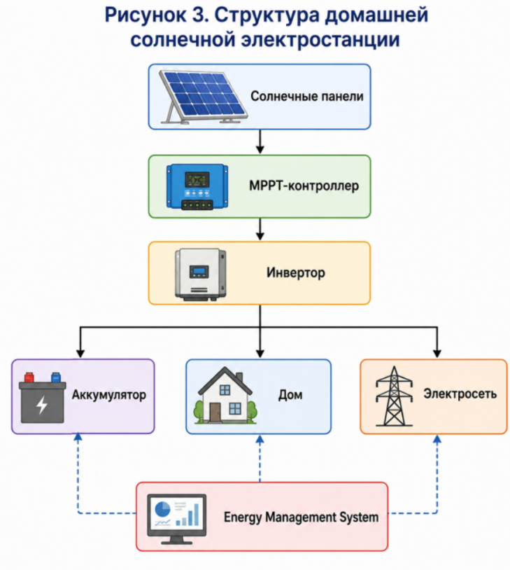
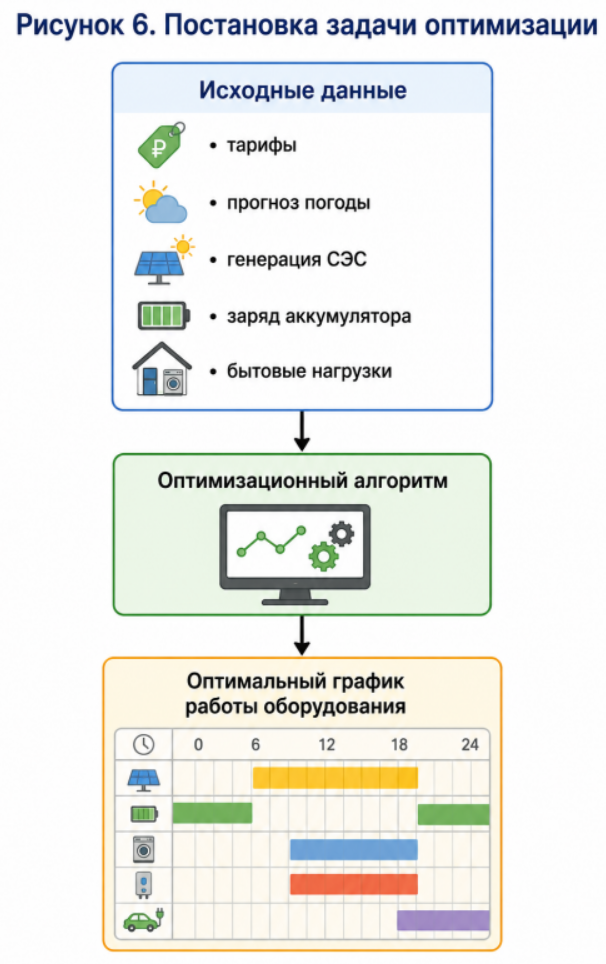
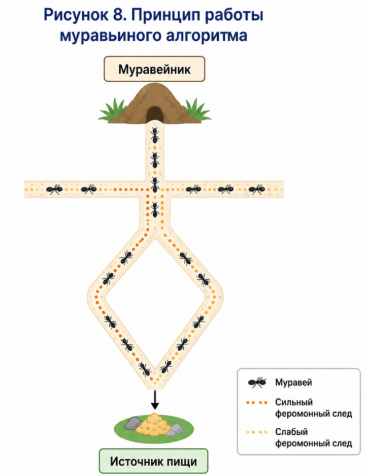
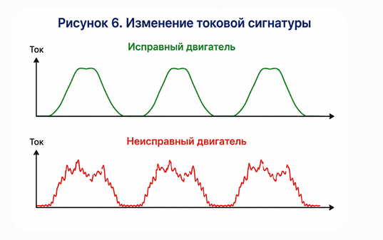
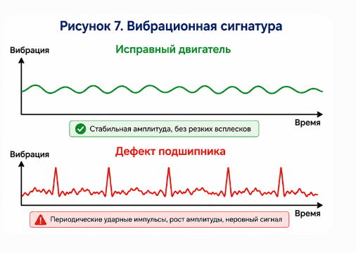

**Занятие 3.1**

**Предиктивная аналитика и превентивное обслуживание в системах умного дома**

**Цель лекции**

Изучить методы предиктивной аналитики, применяемые в интеллектуальных системах умного дома, познакомиться с подходами обнаружения аномалий на основе анализа токовых и вибрационных сигнатур оборудования, а также освоить применение методов обучения без учителя для выявления скрытых закономерностей в данных IoT.

После изучения лекции обучающийся должен:

- понимать принципы построения систем Predictive Maintenance;

- различать реактивное, профилактическое и предиктивное обслуживание оборудования;

- знать основные виды аномалий в данных IoT;

- понимать особенности анализа сигнатур тока и вибрации;

- уметь выбирать методы кластеризации и понижения размерности для диагностики оборудования;

- понимать порядок проведения экспериментов при разработке интеллектуальных систем диагностики.

Лекция формирует компетенции **ML-4 LC-2 с индикаторами ML-4.1** и **LC-2.1**.

**Введение**

Современный умный дом представляет собой распределенную киберфизическую систему, включающую большое количество взаимосвязанных устройств: отопительное оборудование, кондиционеры, вентиляционные установки, холодильники, насосы, стиральные машины, системы очистки воздуха, датчики протечки воды, интеллектуальные электросчетчики и многие другие устройства.

Большинство таких устройств работает непрерывно в течение нескольких лет. Любое оборудование постепенно изнашивается, вследствие чего изменяются его электрические и механические характеристики. На ранних стадиях эти изменения практически незаметны человеку, однако они уже проявляются в измеряемых параметрах --- потребляемом токе, уровне вибрации, температуре двигателя, акустическом шуме и других сигналах.

Если неисправность обнаруживается только после полного отказа оборудования, последствия могут быть весьма серьезными. Например:

- отказ циркуляционного насоса приводит к прекращению отопления;

- заклинивание вентилятора системы вентиляции вызывает перегрев двигателя;

- постепенное разрушение подшипника стиральной машины заканчивается дорогостоящим ремонтом;

- износ компрессора холодильника увеличивает потребление электроэнергии задолго до его выхода из строя;

- небольшая протечка воды способна привести к повреждению отделки помещения и мебели.

Во всех перечисленных случаях существует промежуток времени между появлением первых признаков неисправности и окончательным отказом оборудования. Если научиться обнаруживать эти признаки заранее, можно существенно снизить стоимость эксплуатации здания и повысить надежность инженерных систем.

Именно эту задачу решает **предиктивная аналитика** (*Predictive Analytics*) --- область искусственного интеллекта, позволяющая прогнозировать развитие событий на основании анализа больших объемов данных.

**Эволюция подходов к техническому обслуживанию**

Исторически методы обслуживания оборудования прошли несколько этапов развития.

**Реактивное обслуживание (Reactive Maintenance)**

Наиболее простой подход заключается в эксплуатации оборудования до момента его отказа.

В этом случае ремонт выполняется только после возникновения неисправности.

Достоинства метода:

- отсутствие затрат на профилактическое обслуживание;

- простота организации эксплуатации.

Недостатки значительно серьезнее:

- аварийные остановки оборудования;

- дорогостоящий ремонт;

- высокий риск вторичных повреждений;

- невозможность заранее планировать обслуживание.

Например, если двигатель вентилятора заклинил вследствие разрушения подшипника, зачастую требуется замена не только самого подшипника, но и ротора, корпуса двигателя и системы управления.

**Профилактическое обслуживание (Preventive Maintenance)**

Следующим этапом стало профилактическое обслуживание.

В этом случае оборудование обслуживается через заранее определенные интервалы времени независимо от его фактического состояния.

Например:

- фильтр вентиляции меняется каждые шесть месяцев;

- подшипники заменяются через пять тысяч часов работы;

- насос проходит техническое обслуживание один раз в год.

Такой подход значительно снижает вероятность аварий, однако обладает двумя существенными недостатками.

Во-первых, часть оборудования заменяется слишком рано и фактически не успевает полностью выработать свой ресурс.

Во-вторых, отдельные элементы могут выйти из строя значительно раньше установленного срока обслуживания.

**Предиктивное обслуживание (Predictive Maintenance)**

Современные интеллектуальные системы используют принципиально иной подход.

Вместо обслуживания по календарному графику система непрерывно контролирует техническое состояние оборудования и оценивает вероятность возникновения отказа.

Обслуживание выполняется только тогда, когда модель искусственного интеллекта прогнозирует начало деградации оборудования.

Именно поэтому данный подход получил название **Predictive Maintenance** --- предиктивное (или прогнозное) обслуживание.

Его основные преимущества:

- сокращение числа аварийных остановок;

- снижение затрат на обслуживание;

- увеличение срока службы оборудования;

- уменьшение потребления электроэнергии;

- повышение безопасности эксплуатации.

В системах умного дома предиктивное обслуживание становится одним из важнейших направлений применения искусственного интеллекта.

Наиболее совершенным считается третий подход, поскольку решение принимается на основании анализа реальных данных о работе оборудования.

**Архитектура системы предиктивной аналитики**

Типовая интеллектуальная система диагностики состоит из нескольких взаимосвязанных уровней.

На первом уровне располагаются датчики.

В зависимости от типа оборудования используются:

- датчики тока;

- датчики напряжения;

- акселерометры;

- температурные датчики;

- микрофоны;

- датчики давления;

- расходомеры;

- датчики вибрации.

Полученные измерения передаются через IoT-шлюз в систему обработки данных.

На следующем этапе выполняется предварительная обработка сигналов:

- фильтрация шумов;

- удаление выбросов;

- нормализация;

- синхронизация измерений;

- выделение временных окон.

После этого вычисляются информативные признаки, характеризующие состояние оборудования.

Например:

- среднее значение;

- среднеквадратичное отклонение;

- RMS;

- спектральные коэффициенты;

- коэффициент асимметрии;

- эксцесс.

Полученные признаки поступают в модель машинного обучения.

В зависимости от поставленной задачи используются:

- кластеризация;

- методы обнаружения аномалий;

- снижение размерности;

- нейронные сети.

Последним этапом является принятие решения.

Если вероятность неисправности превышает установленный порог, система автоматически формирует предупреждение владельцу дома либо обслуживающей организации.

**Основные термины предиктивной аналитики**

При изучении систем диагностики необходимо понимать несколько базовых понятий.

**Condition Monitoring** --- непрерывный контроль технического состояния оборудования на основе измеряемых параметров.

**Predictive Maintenance** --- стратегия обслуживания, основанная на прогнозировании вероятности отказа оборудования.

**Failure** --- полный отказ оборудования, при котором дальнейшая эксплуатация невозможна.

**Degradation** --- постепенное ухудшение технического состояния оборудования вследствие естественного износа.

**Remaining Useful Life (RUL)** --- прогнозируемый остаточный ресурс оборудования до возникновения отказа.

**Health Indicator (HI)** --- интегральный показатель технического состояния оборудования, вычисляемый на основании нескольких измеряемых признаков.

Именно оценка **Health Indicator** и прогноз **Remaining Useful Life** являются конечной целью большинства современных систем предиктивной аналитики.

**Обнаружение аномалий в системах IoT (Anomaly Detection)**

Одной из наиболее сложных задач интеллектуального анализа данных является обнаружение аномалий (*Anomaly Detection*).

Под аномалией понимают состояние объекта, существенно отличающееся от нормального режима функционирования.

Для бытовой техники это означает появление признаков, свидетельствующих о начале развития неисправности.

В отличие от классических задач классификации, при обнаружении аномалий заранее известны далеко не все возможные неисправности. Более того, в большинстве случаев данные о реальных отказах отсутствуют вовсе, поскольку оборудование работает исправно большую часть времени.

Именно поэтому для решения подобных задач широко применяются **методы обучения без учителя (Unsupervised Learning)**.

Вместо поиска заранее известных классов алгоритм самостоятельно анализирует структуру данных и выявляет наблюдения, существенно отличающиеся от основной массы.

В системах умного дома такой подход применяется для диагностики:

- холодильников;

- кондиционеров;

- вентиляционных установок;

- насосов;

- систем отопления;

- электродвигателей;

- бытовых вентиляторов;

- систем водоснабжения.

**Почему методы обучения без учителя подходят для IoT**

Рассмотрим систему мониторинга вентиляционной установки.

Ежедневно с датчиков поступают тысячи измерений:

- потребляемый ток;

- температура двигателя;

- уровень вибрации;

- скорость вращения;

- потребляемая мощность.

Первые несколько месяцев оборудование работает абсолютно исправно.

Возникает проблема.

Данные исправной работы имеются в большом количестве.

Данных о неисправностях практически нет.

Следовательно, невозможно построить обычный классификатор.

Вместо этого система изучает структуру **нормального режима работы**.

Если очередное измерение существенно отличается от накопленной статистики, система считает его потенциальной аномалией.

Именно так работают большинство современных систем мониторинга промышленного оборудования.

**Виды аномалий**

В литературе принято выделять три основных типа аномалий.

**Точечные аномалии (Point Anomaly)**

Наиболее простой случай.

Отдельное наблюдение значительно отличается от остальных.

Например, двигатель вентилятора обычно потребляет

1,2 А

но внезапно зарегистрировано значение

4,8 А.

Такое измерение существенно выходит за пределы нормального диапазона.

Подобная ситуация может свидетельствовать:

- о коротком замыкании;

- заклинивании ротора;

- перегрузке двигателя;

- неисправности датчика.

Единственная точка значительно отличается от остальных измерений.

**Контекстные аномалии (Contextual Anomaly)**

В данном случае значение становится аномальным только при определённых условиях.

Например,

температура помещения

28 °C

летом является абсолютно нормальной.

Однако зимой такая температура может говорить о неисправности системы отопления.

Аналогично двигатель холодильника может работать непрерывно несколько часов в жаркий летний день.

Но если такое же поведение наблюдается зимой, возникает подозрение на утечку хладагента.

Следовательно, оценивать необходимо не только само измерение, но и окружающий контекст.

Контекстом могут являться:

- время суток;

- время года;

- наружная температура;

- влажность;

- режим эксплуатации;

- количество пользователей.

Одно и то же значение имеет различную интерпретацию в зависимости от условий эксплуатации.

**Коллективные аномалии (Collective Anomaly)**

Иногда отдельные измерения не являются подозрительными.

Однако их последовательность образует необычный режим работы оборудования.

Например, насос отопления может периодически включаться каждые несколько минут.

Каждое включение отдельно выглядит нормально.

Но если подобная последовательность повторяется десятки раз подряд, это свидетельствует о нестабильной работе системы регулирования.

Другой пример --- постепенный рост вибрации двигателя.

Каждое новое значение отличается от предыдущего совсем незначительно.

Однако вся последовательность указывает на развитие дефекта подшипника.

Именно такие аномалии являются наиболее опасными, поскольку человек редко способен обнаружить их визуально.

По отдельности сигналы выглядят нормально.

Вместе они формируют необычный режим работы оборудования.

**Источники данных для диагностики оборудования**

Для обнаружения аномалий могут использоваться различные типы сигналов.

Наиболее распространёнными являются:

- электрический ток;

- напряжение;

- активная мощность;

- реактивная мощность;

- температура;

- вибрация;

- акустический шум;

- давление;

- расход жидкости;

- скорость вращения.

Однако наиболее информативными считаются именно **токовые** и **вибрационные** сигналы.

Причина заключается в том, что практически любая механическая неисправность приводит к изменению нагрузки электродвигателя.

Соответственно изменяется:

- форма потребляемого тока;

- спектр вибрации;

- спектр шума;

- коэффициент мощности.

Именно поэтому анализ сигнатур тока и вибрации получил широкое распространение в современных системах технической диагностики.

**Signature Analysis**

Одним из наиболее эффективных методов диагностики является **Signature Analysis** --- анализ сигнатур оборудования.

Под сигнатурой понимается характерная форма измеряемого сигнала, отражающая техническое состояние объекта.

Фактически сигнатура является своеобразным «отпечатком пальца» оборудования.

Для каждого режима работы существует собственная сигнатура.

Например, двигатель вентилятора имеет различные сигнатуры:

- при запуске;

- при номинальной нагрузке;

- при работе без нагрузки;

- при засорении воздуховода;

- при износе подшипников;

- при разбалансировке ротора.

Если сигнатура начинает изменяться, система делает вывод о начале деградации оборудования.

**Анализ токовой сигнатуры**

Почти вся бытовая техника оснащена электродвигателями.

Любое изменение механической нагрузки немедленно отражается на форме потребляемого тока.

Например:

- загрязнение фильтра кондиционера увеличивает нагрузку вентилятора;

- заклинивание подшипника увеличивает потребляемый ток;

- износ компрессора холодильника изменяет форму пускового тока;

- засорение насоса приводит к увеличению среднего тока.

Поэтому даже без установки дополнительных датчиков можно диагностировать состояние оборудования только по измерению электрического тока.

Такой подход называется **Motor Current Signature Analysis (MCSA)**.

Появление дополнительных колебаний обычно свидетельствует о возникновении механических дефектов.

**Анализ вибрационной сигнатуры**

Вибрационный анализ считается одним из наиболее чувствительных методов диагностики вращающегося оборудования.

Даже небольшой дефект подшипника вызывает изменение амплитуды вибраций значительно раньше, чем становится заметным изменение температуры двигателя.

Наиболее распространённые причины изменения вибрации:

- износ подшипников;

- нарушение балансировки ротора;

- ослабление крепления;

- повреждение крыльчатки;

- перекос вала;

- разрушение зубчатой передачи.

Современные MEMS-акселерометры позволяют непрерывно измерять вибрацию с высокой точностью при очень низкой стоимости.

Именно поэтому они широко используются в интеллектуальных системах умного дома.

Регулярные высокочастотные импульсы являются характерным признаком повреждения элементов качения подшипника.

**Подготовка данных для анализа сигнатур**

Качество работы любой модели машинного обучения определяется не только выбранным алгоритмом, но и качеством исходных данных. На практике сигналы, поступающие от датчиков, содержат шумы, случайные выбросы и пропуски измерений. Поэтому перед применением методов машинного обучения выполняется предварительная обработка данных.

Обработка обычно включает следующие этапы:

- фильтрацию шумов;

- удаление ошибочных измерений;

- нормализацию;

- разделение сигнала на временные окна;

- вычисление информативных признаков.

Последовательность обработки показана на рисунке.

**Рисунок 8. Подготовка данных для анализа сигнатур**

**Оконный анализ**

Вместо анализа непрерывного сигнала обычно используется разбиение на небольшие временные интервалы (окна).

Например, вибрационный сигнал может разбиваться на участки продолжительностью:

- 0,5 секунды;

- 1 секунда;

- 5 секунд.

Для каждого окна вычисляются статистические характеристики.

Такой подход позволяет обнаруживать постепенные изменения технического состояния оборудования.

**Извлечение признаков**

Вместо передачи в алгоритм тысяч отдельных отсчётов сигнала значительно эффективнее вычислить компактный набор признаков.

Наиболее распространённые признаки представлены в таблице.

  -------------------------------------------------------
  **Признак**              **Назначение**
  ------------------------ ------------------------------
  Среднее значение         Общий уровень сигнала

  RMS                      Средняя мощность сигнала

  Максимум                 Пиковые значения

  Стандартное отклонение   Разброс измерений

  Crest Factor             Импульсные процессы

  Kurtosis                 Выявление ударных процессов

  Skewness                 Асимметрия распределения

  Энергия спектра          Анализ частотных компонентов
  -------------------------------------------------------

**RMS (Root Mean Square)**

Одной из важнейших характеристик является среднеквадратичное значение сигнала (**RMS**).

Для вибрации RMS отражает средний уровень механической энергии.

При разрушении подшипников RMS постепенно увеличивается.

Для потребляемого тока увеличение RMS обычно означает рост механической нагрузки двигателя.

Поэтому RMS является одним из наиболее информативных диагностических признаков.

**Crest Factor**

Коэффициент Crest Factor определяется как отношение максимального значения сигнала к его RMS.

Он характеризует наличие коротких ударных процессов.

Для исправного оборудования Crest Factor обычно имеет небольшое значение.

При разрушении подшипников возникают короткие ударные импульсы.

В результате Crest Factor значительно увеличивается.

**Kurtosis**

Эксцесс (Kurtosis) характеризует форму распределения сигнала.

При нормальной работе оборудования распределение близко к нормальному.

При появлении ударных процессов распределение становится более \"острым\".

Поэтому рост Kurtosis является одним из ранних признаков развития механических дефектов.

**Спектральный анализ**

Во многих случаях анализ временного сигнала оказывается недостаточным.

Например, визуально два сигнала могут выглядеть практически одинаково.

Однако после перехода в частотную область различия становятся очевидными.

Для этого применяется быстрое преобразование Фурье (**FFT --- Fast Fourier Transform**).

FFT позволяет определить, какие частоты присутствуют в измеряемом сигнале.

Для вращающегося оборудования каждая неисправность сопровождается появлением новых спектральных составляющих.

Например:

- повреждение наружного кольца подшипника;

- повреждение внутреннего кольца;

- разрушение сепаратора;

- разбалансировка ротора.

Каждый дефект создаёт собственный набор гармоник.

Поэтому спектральный анализ является одним из основных методов современной диагностики.

**Методы обучения без учителя**

В задачах диагностики оборудования чаще всего отсутствуют размеченные данные.

Поэтому используются алгоритмы обучения без учителя.

Они позволяют самостоятельно обнаруживать закономерности в данных.

Наиболее распространёнными являются:

- K-Means;

- DBSCAN;

- иерархическая кластеризация;

- PCA;

- t-SNE.

Именно эти алгоритмы входят в состав библиотеки **Scikit-Learn** и рекомендуются для решения задач анализа данных IoT.

**Алгоритм K-Means**

Алгоритм K-Means относится к методам неиерархической кластеризации.

Его задача заключается в разделении множества объектов на заранее заданное число кластеров.

Работа алгоритма выполняется следующим образом.

1.  Случайно выбираются центры кластеров.

2.  Каждый объект относится к ближайшему центру.

3.  Центры пересчитываются.

4.  Процесс повторяется до достижения устойчивого решения.

В задачах диагностики оборудования K-Means позволяет автоматически разделить режимы работы.

Например:

- нормальная работа;

- повышенная нагрузка;

- начало деградации;

- аварийный режим.

Следует учитывать, что количество кластеров необходимо задавать заранее.

Это является основным ограничением алгоритма.

**Пример использования Scikit-Learn**

from sklearn.cluster import KMeans

model = KMeans(

n_clusters=3,

random_state=42

)

labels = model.fit_predict(features)

После обучения каждый объект получает номер кластера.

**DBSCAN**

Алгоритм DBSCAN основан на анализе плотности расположения объектов.

Главное преимущество DBSCAN заключается в том, что число кластеров заранее задавать не требуется.

Кроме того, алгоритм способен автоматически обнаруживать выбросы.

Именно поэтому DBSCAN широко применяется при поиске аномалий.

Преимущества DBSCAN:

- неизвестно количество кластеров;

- обнаружение выбросов;

- устойчивость к шуму.

Недостатки:

- чувствительность к выбору параметров;

- ухудшение работы при сильно различной плотности данных.

**Пример использования**

from sklearn.cluster import DBSCAN

model = DBSCAN(

eps=0.4,

min_samples=10

)

labels = model.fit_predict(features)

Объекты, получившие метку

-1

считаются аномальными.

Именно такой механизм часто используется для обнаружения неисправностей оборудования.

**Иерархическая кластеризация**

Иерархическая кластеризация последовательно объединяет наиболее похожие объекты.

Результатом является дерево кластеров --- **дендрограмма**.

Данный метод удобен для анализа структуры данных и определения возможного количества кластеров.

Однако при больших объёмах данных вычислительная сложность значительно возрастает.

**Методы понижения размерности**

При диагностике оборудования после извлечения признаков каждый объект может описываться десятками или даже сотнями параметров.

Например, для одного временного окна вибрационного сигнала могут вычисляться:

- RMS;

- дисперсия;

- максимум;

- минимум;

- Crest Factor;

- Kurtosis;

- Skewness;

- спектральные коэффициенты;

- энергия гармоник;

- частота максимального пика;

- десятки других характеристик.

В результате каждое измерение представляется точкой в многомерном пространстве.

Анализировать такие данные визуально невозможно.

Для решения этой задачи применяются методы **снижения размерности (Dimensionality Reduction)**.

Они позволяют заменить большое количество взаимосвязанных признаков несколькими новыми признаками, сохранив при этом основную информацию.

Наиболее распространёнными алгоритмами являются:

- PCA (Principal Component Analysis);

- t-SNE (t-distributed Stochastic Neighbor Embedding).

**Метод главных компонент (PCA)**

PCA является одним из наиболее известных методов понижения размерности.

Основная идея заключается в поиске новых координатных осей, вдоль которых изменчивость данных максимальна.

Вместо десятков исходных признаков строятся несколько новых независимых признаков --- **главных компонент**.

При этом большая часть информации сохраняется.

Например, вместо 30 исходных признаков можно оставить всего две или три главные компоненты.

Это позволяет:

- значительно ускорить вычисления;

- уменьшить влияние шума;

- упростить визуализацию;

- устранить избыточность данных.

После преобразования похожие объекты остаются расположенными рядом, а различия между кластерами становятся более заметными.

**Использование PCA при диагностике оборудования**

Рассмотрим пример.

Для каждого двигателя вычислено двадцать диагностических признаков.

После применения PCA остаются две главные компоненты.

Если построить график этих компонент, можно увидеть естественные группы оборудования.

Например:

- исправные двигатели;

- двигатели с повышенным износом;

- оборудование с дефектами подшипников.

Таким образом, PCA позволяет не только уменьшить размерность данных, но и значительно облегчить их интерпретацию.

**Пример использования PCA**

from sklearn.decomposition import PCA

pca = PCA(n_components=2)

X_pca = pca.fit_transform(features)

Полученный массив X_pca можно использовать для построения графиков или дальнейшей кластеризации.

**Метод t-SNE**

Если PCA хорошо сохраняет общую структуру данных, то алгоритм **t-SNE** ориентирован на визуализацию локальных взаимосвязей.

Он особенно полезен, когда необходимо увидеть естественные группы объектов.

Часто после применения t-SNE становятся заметны скрытые кластеры, которые трудно обнаружить другими способами.

Именно поэтому t-SNE широко применяется:

- при исследовании новых данных;

- анализе телеметрии IoT;

- сравнении режимов работы оборудования;

- поиске неизвестных неисправностей.

Следует помнить, что t-SNE используется главным образом для анализа данных и визуализации, а не для подготовки признаков перед обучением моделей.

**Пример использования t-SNE**

from sklearn.manifold import TSNE

tsne = TSNE(

n_components=2,

random_state=42

)

X_tsne = tsne.fit_transform(features)

Полученные координаты удобно отображать на двумерной диаграмме рассеяния.

**Организация экспериментов с моделями машинного обучения**

Разработка интеллектуальной системы диагностики невозможна без проведения экспериментов.

Эксперимент позволяет подтвердить или опровергнуть выдвинутую гипотезу.

В рамках компетенции **LC-2.1** эксперимент включает несколько последовательных этапов.

**Постановка гипотезы**

Любое исследование начинается с формулировки гипотезы.

Например:

**Гипотеза 1.**

Рост RMS вибрационного сигнала позволяет обнаружить начало разрушения подшипника раньше появления внешних признаков неисправности.

Или:

**Гипотеза 2.**

Алгоритм DBSCAN обнаруживает аномалии в телеметрии вентиляционной установки эффективнее алгоритма K-Means.

После формулировки гипотезы определяется способ её проверки.

**Подготовка набора данных**

Эксперимент невозможен без качественных данных.

Для каждого объекта необходимо собрать телеметрию:

- ток;

- вибрацию;

- температуру;

- мощность;

- скорость вращения.

Затем вычисляются диагностические признаки.

Полученная таблица используется для обучения моделей.

**Обучение нескольких моделей**

Для объективного сравнения рекомендуется обучить несколько алгоритмов.

Например:

  ----------------------------------------------------------
  **Алгоритм**    **Назначение**
  --------------- ------------------------------------------
  K-Means         Базовая кластеризация

  DBSCAN          Поиск аномалий

  PCA + K-Means   Кластеризация после снижения размерности

  PCA + DBSCAN    Поиск выбросов
  ----------------------------------------------------------

Сравнение нескольких моделей позволяет выбрать наиболее эффективное решение.

**Анализ результатов**

После обучения моделей анализируются полученные результаты.

При этом оценивается:

- количество обнаруженных кластеров;

- число аномальных объектов;

- устойчивость модели;

- скорость вычислений;

- интерпретируемость результатов.

Если модель формирует слишком много ложных срабатываний, параметры алгоритма корректируются.

После чего эксперимент повторяется.

Именно многократное повторение экспериментов является одним из важнейших этапов разработки систем искусственного интеллекта.

**Практический пример**

Рассмотрим интеллектуальную систему контроля вентиляционной установки.

На вентиляторе установлен акселерометр.

Каждую секунду измеряется уровень вибрации.

Для каждого окна длительностью одна секунда вычисляются:

- RMS;

- стандартное отклонение;

- Crest Factor;

- Kurtosis.

Полученные признаки поступают в алгоритм DBSCAN.

Большинство измерений образуют плотный кластер.

Однако постепенно появляются отдельные выбросы.

Это свидетельствует о начале изменения режима работы двигателя.

Через несколько недель количество выбросов возрастает.

Система автоматически формирует предупреждение:

**\"Обнаружено изменение вибрационной сигнатуры. Рекомендуется проведение технического обслуживания вентиляционной установки.\"**

В результате обслуживание выполняется до возникновения аварии.

Подобный подход широко используется в современных системах промышленного мониторинга и постепенно внедряется в интеллектуальные системы умного дома.

**Преимущества применения методов обучения без учителя**

Использование методов обучения без учителя обеспечивает ряд важных преимуществ:

- отсутствует необходимость в размеченных данных;

- обнаруживаются неизвестные ранее неисправности;

- возможен анализ больших объёмов телеметрии;

- выявляются скрытые закономерности;

- снижается стоимость обслуживания оборудования;

- уменьшается вероятность аварийных отказов;

- увеличивается срок службы бытовой техники.

Именно поэтому методы обучения без учителя становятся неотъемлемой частью современных интеллектуальных систем мониторинга.

**Основные выводы лекции**

Предиктивная аналитика позволяет перейти от устранения последствий аварий к их предупреждению. Основным источником информации о состоянии оборудования являются данные датчиков тока, вибрации, температуры и других физических параметров. После предварительной обработки сигналов вычисляются диагностические признаки, отражающие техническое состояние оборудования.

Для анализа таких данных широко применяются методы **обучения без учителя**. Алгоритмы **K-Means**, **DBSCAN** и **иерархическая кластеризация** позволяют автоматически выделять режимы работы оборудования и обнаруживать аномальные состояния. Методы **PCA** и **t-SNE** используются для снижения размерности и визуализации многомерных данных, облегчая интерпретацию результатов.

Экспериментальная проверка моделей включает формулирование гипотезы, подготовку данных, обучение нескольких моделей, анализ качества их работы и повторение экспериментов при изменении параметров. Такой подход обеспечивает воспроизводимость исследований и позволяет выбрать наиболее эффективный алгоритм для решения практических задач.

Применение технологий **Anomaly Detection**, **Predictive Maintenance** и **Signature Analysis** в системах умного дома позволяет значительно повысить надёжность бытовой техники, снизить эксплуатационные расходы и предотвратить возникновение аварийных ситуаций.

**Контрольные вопросы**

1.  Что понимается под предиктивным обслуживанием оборудования?

2.  Чем реактивное обслуживание отличается от профилактического и предиктивного?

3.  Что такое Anomaly Detection?

4.  Какие виды аномалий выделяют в данных IoT?

5.  Что называют сигнатурой оборудования?

6.  Какие преимущества даёт анализ токовой сигнатуры?

7.  Почему вибрационный анализ считается одним из наиболее чувствительных методов диагностики?

8.  Какие признаки чаще всего вычисляют при обработке сигналов?

9.  Для чего применяется быстрое преобразование Фурье (FFT)?

10. В чём заключается принцип работы алгоритма K-Means?

11. Какие преимущества имеет алгоритм DBSCAN?

12. Что представляет собой иерархическая кластеризация?

13. Для чего используется метод PCA?

14. Чем отличается t-SNE от PCA?

15. Какие этапы включает эксперимент при разработке модели машинного обучения?

16. Какие показатели необходимо учитывать при сравнении моделей?

17. Почему методы обучения без учителя особенно востребованы в задачах диагностики оборудования?

18. Какие преимущества даёт использование предиктивной аналитики в си
